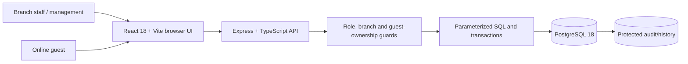
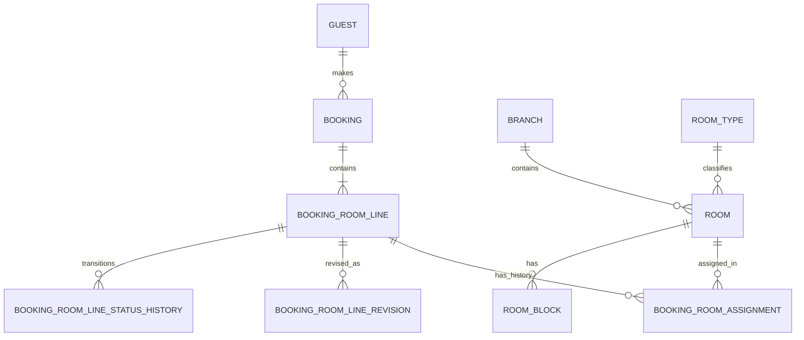
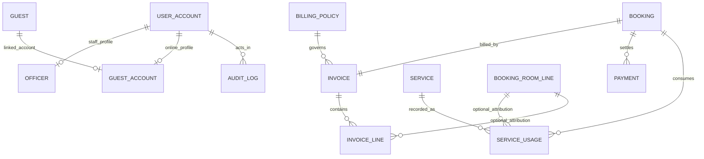
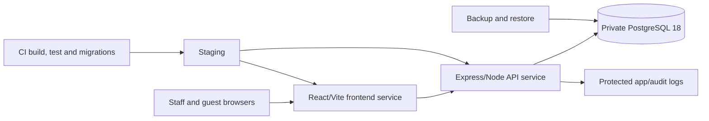

**SkyNest Hotel Reservation and Guest Services Management System**

**Version 1.4 draft — multi-room booking amendment**

**Prepared by: Project Team**

\[Insert team member names and registration numbers\]

Database Systems Project

18 September 2026

> This file retains its original filename to avoid breaking repository references. The README stack and online guest scope are working decisions; the normalized room and multi-room booking target is a documented amendment pending team/evaluator review and implementation. Existing migrations are not thereby approved as the target. The four figures in this draft depict the target; Table 40 remains the original ER transcription for comparison, not target DDL.

> **Diagram status:** The legacy `SkyNest_HRGSMS_SRS_assets` folder is not present in this checkout. The unavailable image links and captions have been removed. The four Mermaid figures below describe the approved stack and proposed target relationships; they do not claim to reproduce the original ER. Text and §6.1.4 remain authoritative, and team/evaluator review of target deviations remains required (TBD-13).

# Table of Contents

- [1. Introduction](#1-introduction)
  - [1.1 Purpose](#11-purpose)
  - [1.2 Document Conventions](#12-document-conventions)
  - [1.3 Intended Audience and Reading Suggestions](#13-intended-audience-and-reading-suggestions)
  - [1.4 Product Scope](#14-product-scope)
  - [1.5 References](#15-references)
- [2. Overall Description](#2-overall-description)
  - [2.1 Product Perspective](#21-product-perspective)
  - [2.2 Product Functions](#22-product-functions)
  - [2.3 User Classes and Characteristics](#23-user-classes-and-characteristics)
  - [2.4 Operating Environment](#24-operating-environment)
  - [2.5 Design and Implementation Constraints](#25-design-and-implementation-constraints)
  - [2.6 User Documentation](#26-user-documentation)
  - [2.7 Assumptions and Dependencies](#27-assumptions-and-dependencies)
- [3. External Interface Requirements](#3-external-interface-requirements)
  - [3.1 User Interfaces](#31-user-interfaces)
  - [3.2 Hardware Interfaces](#32-hardware-interfaces)
  - [3.3 Software Interfaces](#33-software-interfaces)
  - [3.4 Communications Interfaces](#34-communications-interfaces)
- [4. System Features](#4-system-features)
  - [4.1 Authentication and Role-Based Access Control](#41-authentication-and-role-based-access-control)
  - [4.2 Branch, Room Type, Amenity and Room Management](#42-branch-room-type-amenity-and-room-management)
  - [4.3 Guest Profile Management](#43-guest-profile-management)
  - [4.4 Room Availability and Reservation Management](#44-room-availability-and-reservation-management)
  - [4.5 Guest Check-In and Active Stay Management](#45-guest-check-in-and-active-stay-management)
  - [4.6 Chargeable Guest Service Management](#46-chargeable-guest-service-management)
  - [4.7 Billing, Invoicing and Payment Management](#47-billing-invoicing-and-payment-management)
  - [4.8 Checkout, Cancellation and No-Show Management](#48-checkout-cancellation-and-no-show-management)
  - [4.9 Management Reports and Operational Dashboards](#49-management-reports-and-operational-dashboards)
  - [4.10 Administration, Configuration and Audit](#410-administration-configuration-and-audit)
- [5. Other Nonfunctional Requirements](#5-other-nonfunctional-requirements)
  - [5.1 Performance Requirements](#51-performance-requirements)
  - [5.2 Safety Requirements](#52-safety-requirements)
  - [5.3 Security Requirements](#53-security-requirements)
  - [5.4 Software Quality Attributes](#54-software-quality-attributes)
  - [5.5 Business Rules](#55-business-rules)
- [6. Other Requirements](#6-other-requirements)
  - [6.1 Database Requirements and Design](#61-database-requirements-and-design)
  - [6.2 Deployment Architecture](#62-deployment-architecture)
  - [6.3 CI/CD Pipeline](#63-cicd-pipeline)
  - [6.4 Test Requirements](#64-test-requirements)
  - [6.5 Acceptance Criteria](#65-acceptance-criteria)
  - [6.6 Migration and Initialization](#66-migration-and-initialization)
  - [6.7 Localization, Legal and Policy Considerations](#67-localization-legal-and-policy-considerations)
- [Appendix A: Glossary](#appendix-a-glossary)
- [Appendix B: Analysis Models](#appendix-b-analysis-models)
- [Appendix C: To Be Determined List](#appendix-c-to-be-determined-list)

# List of Figures

1. Figure 1 - High-Level Component Architecture
2. Figure 2 - Target Core Reservation Relationships
3. Figure 3 - Target Service, Billing, Identity and Audit Relationships
4. Figure 4 - Target Deployment Architecture

# List of Tables

| Table 1 - Revision History                                       | Table 30 - Performance Requirements                 |
|------------------------------------------------------------------|-----------------------------------------------------|
| Table 2 - Intended Audience and Reading Suggestions              | Table 31 - Safety Requirements                      |
| Table 3 - User Classes and Characteristics                       | Table 32 - Security Requirements                    |
| Table 4 - Design and Implementation Constraints                  | Table 33 - Reliability Requirements                 |
| Table 5 - Assumptions and Dependencies                           | Table 34 - Usability Requirements                   |
| Table 6 - User Interface Screens                                 | Table 35 - Maintainability Requirements             |
| Table 7 - User Interface Requirements                            | Table 36 - Portability Requirements                 |
| Table 8 - Software Interfaces                                    | Table 37 - Logging Requirements                     |
| Table 9 - Communications Interface Requirements                  | Table 38 - Business Rules                           |
| Table 10 - Use Case - Authenticate Staff or Online Guest        | Table 39 - Entity Summary                           |
| Table 11 - Authentication and Access Requirements                | Table 40 - Core Data Dictionary                     |
| Table 12 - Use Case - Maintain Room Inventory                    | Table 41 - Database Integrity Requirements          |
| Table 13 - Room Inventory Requirements                           | Table 42 - Normalization Progress                   |
| Table 14 - Use Case - Create or Update Guest Profile             | Table 43 - ACID Application                         |
| Table 15 - Guest Management Requirements                         | Table 44 - Transaction and Concurrency Requirements |
| Table 16 - Use Case - Search Availability and Create Booking     | Table 45 - Required SQL Objects                     |
| Table 17 - Availability and Reservation Requirements             | Table 46 - Index Requirements                       |
| Table 18 - Use Case - Check In Guest                             | Table 47 - Required Views                           |
| Table 19 - Check-In Requirements                                 | Table 48 - Seed Data Baseline                       |
| Table 20 - Use Case - Record Service Usage                       | Table 49 - Backup and Recovery Requirements         |
| Table 21 - Guest Service Requirements                            | Table 50 - Deployment Requirements                  |
| Table 22 - Use Case - Generate Bill and Record Payment           | Table 51 - CI/CD Requirements                       |
| Table 23 - Billing and Payment Requirements                      | Table 52 - Required Test Levels                     |
| Table 24 - Use Case - Check Out Guest                            | Table 53 - Requirements Traceability Matrix         |
| Table 25 - Checkout and Cancellation Requirements                | Table 54 - Key Acceptance Tests                     |
| Table 26 - Use Case - Generate Management Report                 | Table 55 - Glossary                                 |
| Table 27 - Reporting Requirements                                | Table 56 - Analysis Model Index                     |
| Table 28 - Use Case - Manage User Account and Review Audit Trail | Table 57 - To Be Determined Items                   |
| Table 29 - Administration and Audit Requirements                 |                                                     |

# Revision History

**Table 1 - Revision History**

| **Name**                      | **Date**        | **Reason for Changes**                                                                            | **Version** |
|-------------------------------|-----------------|---------------------------------------------------------------------------------------------------|-------------|
| Project Team                  | 24 July 2026    | Complete SRS created from the supplied project brief, IEEE-style SRS template and example design. | 1.0         |
| Project Team                  | 18 September 2026 | Draft alignment of entities, keys, attributes and data types with the team-supplied final ER transcription; unresolved choices listed in Appendix C. | 1.1 draft |
| Project Team                  | 18 September 2026 | Confirm README implementation stack, online guest accounts and direct booking, and approve a booking–room assignment-history extension to preserve the final ER's room pointer. | 1.2 draft |
| Imandi                        | 24 September 2026 | Specify `booking_room_assignment` as the only stored booking–room link; derive occupancy and reservation state, and separate physical room condition. Corrective implementation and team/evaluator review remain pending. | 1.3 draft |
| Imandi                        | 24 September 2026 | Amend the target to allow multiple separately dated/priced room lines per booking, per-line lifecycle and assignment history. Existing single-room migrations remain unchanged; implementation and team/evaluator review are pending. | 1.4 draft |
| Imandi                        | 25 September 2026 | Reconcile the draft version, define working cross-owner data/reporting contracts, allow audited same-day policy corrections and add target architecture/relationship diagrams. Missing legacy image assets and team/evaluator approval remain open. | 1.4 draft |
| Project Supervisor / Lecturer | To be completed | Review, corrections and formal approval.                                                          | TBD         |

# 1. Introduction

## 1.1 Purpose

The purpose of this document is to present a verifiable description of the SkyNest Hotel Reservation and Guest Services Management System (HRGSMS). This Version 1.4 draft preserves the team-supplied final ER transcription for comparison and specifies normalized room occupancy and multi-room bookings as target amendments. Corrective implementation and team/evaluator review remain pending. It describes the purpose and features of the system, its interfaces, the constraints under which it shall operate, the relational data model, and the responses expected when users or external conditions stimulate the system.

This SRS covers the complete university database project: requirements analysis, a normalized SQL database, a React/Vite frontend with an Express/Node.js backend, parameterized raw SQL data access, procedures, functions, triggers, reporting, testing, deployment and CI/CD. It is intended for stakeholders, developers, database designers, testers and evaluators and shall be the baseline for design, implementation and acceptance.

## 1.2 Document Conventions

Mandatory requirements use the word “shall.” Recommendations use “should,” and optional capabilities use “may.” Functional requirements are identified as FR-xxx, database requirements as DBR-xxx, interface requirements as IR-xxx, nonfunctional requirements as NFR-xxx, business rules as BR-xxx and deployment requirements as DR-xxx. Critical and High priorities are required for the minimum acceptable release unless formally waived.

The document follows the section order of the supplied IEEE-style SRS template and uses the use-case and diagram presentation style of the supplied example. The main narrative uses 14-point Times New Roman with a plain black-and-white layout. Light grey fills are used only for table headings and diagram boxes. Tables and figure captions use compact text where required to preserve readability and remain within the requested page limit.

## 1.3 Intended Audience and Reading Suggestions

**Table 2 - Intended Audience and Reading Suggestions**

| **Audience**                      | **Recommended Reading Sequence**                                                                                                                                     |
|-----------------------------------|----------------------------------------------------------------------------------------------------------------------------------------------------------------------|
| Lecturer / project evaluator      | Sections 1 and 2 for context; Section 4 for functional scope; Sections 5 and 6 for quality, database and deployment evidence; Appendices for terminology and models. |
| Hotel management stakeholder      | Sections 1, 2, 4.4 to 4.9 and 5.5 business rules.                                                                                                                    |
| Database designer / SQL developer | Sections 4, 5.5 and 6.1, especially schema, normalization, transactions, SQL objects, indexing and reporting views.                                                  |
| React/Express developer          | Sections 2.4 to 2.5, Section 3, Section 4, and Sections 6.2 to 6.3.                                                                                                  |
| Tester / quality reviewer         | Use cases and requirements in Section 4, measurable requirements in Section 5, and test/acceptance requirements in Sections 6.4 and 6.5.                             |
| Deployment / operations member    | Sections 2.4, 2.5, 5.3, and Sections 6.2 to 6.7.                                                                                                                     |

Readers seeking an overview should begin with Sections 1 and 2. Implementers should then read the relevant interfaces and system features before the database and deployment requirements. Testers should trace each uniquely identified requirement to the verification method stated in its table.

## 1.4 Product Scope

SkyNest Hotels is a regional hotel chain with branches in Colombo, Kandy and Galle. The current desktop-based and manual processes have contributed to overbooking, delayed billing and data-entry errors. HRGSMS will replace those processes with a unified web application whose authoritative data is stored in a normalized relational database.

The system shall support branch and room management, guest profiles, availability searches, multi-room reservations, check-in, active-stay service usage, partial payments, invoice generation, checkout and management reports. Both authorized staff and online guest-account holders shall have appropriate booking workflows; online guests are limited to their linked guest records and their own reservations. It shall prevent overlapping active room lines for the same physical room, maintain consistent line and room states, preserve historical rates/prices, and prevent a line checkout until the consolidated balance is paid.

The approved implementation stack is the one documented in `README.md`: React 18 with TypeScript and Vite for the frontend, Express with TypeScript on Node.js for the backend, and PostgreSQL as the reference database. The backend shall execute reviewed, parameterized SQL through a PostgreSQL driver. ORM frameworks, Supabase, Firebase and equivalent backend-as-a-service database abstractions are prohibited. The system shall be fully implemented, tested and deployed using a CI/CD pipeline. This specification change does not require a code-stack migration.

- Reduce overbooking by enforcing room/date conflicts at database level.

- Reduce billing delay and error through reproducible room and service calculations.

- Use normalization, keys, constraints and referential integrity to reduce anomalies.

- Support partial payments while clearly identifying outstanding balances.

- Provide the five mandatory management reports from controlled SQL views or queries.

- Deliver a repeatable deployment through migrations, automated tests and CI/CD.

## 1.5 References

1.  Project 5 - Hotel Reservation and Guest Services Management System, supplied project description, two pages.

2.  Software Requirements Specification for \<Project\>, supplied IEEE-style template based on Karl E. Wiegers.

3.  Web Publishing System Software Requirements Specification, Version 1.0, supplied example SRS.

4.  The approved project repository, SQL migrations, test plan, deployment records and user guide produced by the project team.

5.  Final ER diagram supplied by the project team on 18 September 2026 (the transcription supplied for this revision). The entity and attribute inventory in Section 6.1 reflects that reference; its unresolved semantics are identified rather than inferred.

# 2. Overall Description

## 2.1 Product Perspective

HRGSMS is a new centralized web system that replaces separate desktop and manual processes used by the three SkyNest branches. It is self-contained for the academic release and shall not depend on an external booking engine, payment gateway, ORM, Supabase, Firebase or cloud document database. It will expose controlled user interfaces while retaining all authoritative operational and financial state in PostgreSQL.

**Figure 1 - High-Level Component Architecture**

The system environment contains browser users, a React/Vite frontend, an Express/Node.js API with a raw-SQL access layer, PostgreSQL database objects, source control and CI/CD, and logging/audit facilities. Multi-table state changes shall be performed inside backend transactions or controlled SQL routines so the user interface cannot leave the database partially updated. Figure 1 depicts the approved README stack and both staff and direct online guest paths.

## 2.2 Product Functions

- Authenticate staff and online guest accounts; enforce staff role/branch scope and guest ownership scope.

- Maintain branches, room types, amenities, room records, statuses, blocks and rates.

- Create and update guest profiles while avoiding unnecessary duplication.

- Let online guests and authorized staff search availability and create reservations; permit online guests to view their own bookings and request eligible cancellation, while staff handle booking date/room modifications.

- Check guests in and update room occupancy atomically.

- Record room service, spa, laundry, minibar and other chargeable services.

- Generate invoices, accept partial payments and display outstanding balances.

- Prevent checkout until all required charges are paid.

- Release rooms after checkout and support cleaning and maintenance states.

- Generate occupancy, billing, service usage, monthly revenue and preference reports.

- Record auditable booking, room, payment and administrative histories.

## 2.3 User Classes and Characteristics

**Table 3 - User Classes and Characteristics**

| **User Class**                    | **Characteristics and Main Privileges**                                                                                                                              |
|-----------------------------------|----------------------------------------------------------------------------------------------------------------------------------------------------------------------|
| Online Guest                      | Uses a `user_account` linked to `guest` through `guest_account` to manage their own profile, search availability, create and view reservations, and request eligible cancellation; cannot access another guest's records or staff operations. |
| Staff-assisted Guest              | Provides identity/contact and stay information through authorized staff without requiring an online login; receives confirmations, invoices and receipts. |
| Front Desk Staff                  | Frequent operational user. Searches availability, manages guests and bookings, checks guests in, records payments and completes checkout within an assigned branch.  |
| Service Staff                     | Records approved service usage and physical room-condition changes within the assigned branch. Cannot edit the chain-wide service catalogue, booking dates, room rates, invoices or payments. |
| Branch Manager                    | Maintains physical rooms and dated blocks within the assigned branch, approves controlled discounts and views branch reports. Cannot edit chain-wide catalogue rates. |
| Chain Manager                    | Views cross-branch reports, revenue and service trends; may maintain chain-wide room-type, amenity and service catalogues and publish billing policy. Otherwise read-only for branch operations. |
| System Administrator              | Manages branch records, accounts, roles and non-financial reference configuration. Cannot bypass database integrity or financial constraints or edit chain-wide catalogue prices. |
| Database Administrator / Auditor  | Maintains database availability, migration, backup and recovery and reviews audit evidence. Direct data changes are restricted and logged.                           |

## 2.4 Operating Environment

- Modern desktop or tablet web browser with JavaScript enabled.

- React 18/TypeScript frontend built with Vite and an Express/TypeScript API on a supported Node.js runtime, hosted on Linux or a compatible platform.

- PostgreSQL relational database on a separate protected service or host.

- HTTPS between browser and application and an encrypted database connection where supported.

- Git-based source control and a CI/CD runner capable of starting a temporary PostgreSQL database.

- Currency displayed in Sri Lankan Rupees (LKR) and operational time interpreted in Asia/Colombo.

- A reachable staging and production deployment for final evaluation.

## 2.5 Design and Implementation Constraints

**Table 4 - Design and Implementation Constraints**

| **ID** | **Constraint**                                                                                                                                                         |
|--------|------------------------------------------------------------------------------------------------------------------------------------------------------------------------|
| CON-01 | PostgreSQL shall be the database for this project; another database engine is not part of the approved implementation baseline.                         |
| CON-02 | The frontend shall use React 18, TypeScript and Vite; the backend shall use Express with TypeScript on Node.js, as documented in `README.md`. |
| CON-03 | The application shall use parameterized raw SQL. No ORM, Supabase, Firebase or equivalent database abstraction is permitted.                                           |
| CON-04 | The schema shall demonstrate normalization, primary keys, foreign keys, uniqueness, domain checks, indexing, views, procedures/functions and triggers where justified. |
| CON-05 | Concurrent requests shall not create overlapping active bookings for one room.                                                                                         |
| CON-06 | Financial values shall use exact decimal types; rates and prices shall be preserved as historical snapshots.                                                           |
| CON-07 | Schema changes shall be version-controlled SQL migrations and tested before deployment.                                                                                |
| CON-08 | Secrets and production database credentials shall not be stored in the repository or exposed to the browser.                                                           |
| CON-09 | The delivered system shall include minimum demonstration data required by the project brief.                                                                           |
| CON-10 | The complete system shall be deployed through a CI/CD pipeline.                                                                                                        |

## 2.6 User Documentation

- Role-oriented user guide for online guests, front-desk staff, service staff, managers and administrators.

- Quick reference for booking, check-in, service entry, payment and checkout.

- Database setup and migration guide with clean installation and seed instructions.

- Deployment and rollback guide for the CI/CD pipeline and hosting environment.

- Test-data loading guide and report-verification examples.

- API/route and SQL-object documentation maintained with the repository.

## 2.7 Assumptions and Dependencies

**Table 5 - Assumptions and Dependencies**

| **ID** | **Assumption / Dependency**                                                                                                           |
|--------|---------------------------------------------------------------------------------------------------------------------------------------|
| A/D-01 | SkyNest begins with three branches: Colombo, Kandy and Galle.                                                                         |
| A/D-02 | One booking has one primary guest and may contain one or more room-reservation lines, including two single rooms for the same dates. Every line has its own room, stay interval, guest count, agreed rate and operational status; the initial release keeps all lines within one branch and issues one booking reference and consolidated bill. A separately managed group of unrelated bookings is outside this scope. |
| A/D-03 | Check-in date is inclusive and check-out date is exclusive for overlap and billing-night calculations.                                |
| A/D-04 | Financial tax, service-charge, discount-limit and flat-fee values come from a typed, effective-dated billing policy rather than hard-coded values or generic `system_config` text. |
| A/D-05 | Payment information records method, amount, reference and status; direct card processing is outside the assessed scope.               |
| A/D-06 | Staff and online guests use reliable network connectivity and approved credentials.                                                   |
| A/D-07 | The hosting platform supplies protected secrets, HTTPS and a supported PostgreSQL service.                                            |
| A/D-08 | Legacy desktop data format is unknown; automatic migration is not mandatory unless a source format is later provided.                 |
| A/D-09 | Online guest accounts and direct reservations are in scope through `guest_account`; staff-assisted reservations remain available for guests without accounts. |

Out of scope for Version 1.0 are a live payment gateway, smart-lock or point-of-sale integration, dynamic pricing from machine learning, loyalty points, housekeeping payroll, inventory procurement, multi-currency settlement and native mobile applications.

# 3. External Interface Requirements

## 3.1 User Interfaces

The interface shall use a consistent, responsive layout with a top-level navigation appropriate to the authenticated role. Forms shall display labels, required-field indicators, validation messages and safe confirmation dialogs. Lists shall support filtering, pagination and branch scoping. Error messages shall explain corrective action without exposing SQL statements, stack traces or secrets.

**Table 6 - User Interface Screens**

| **Screen**                    | **Primary User**        | **Purpose**                                                                                     |
|-------------------------------|-------------------------|-------------------------------------------------------------------------------------------------|
| Login                         | Staff / Online Guest    | Authenticate staff with role/branch scope or a linked guest with own-record scope.              |
| Guest Registration / Link     | Online Guest           | Create an account or securely link a verified existing guest profile without account takeover. |
| Dashboard / Account Summary   | Staff / Online Guest    | Staff see branch operations; online guests see only their own reservation/account summary.      |
| Availability Search           | Online Guest / Front Desk | Enter branch, dates, capacity and optional room type; display currently sellable rooms.       |
| Booking Form                  | Online Guest / Front Desk | Create a direct or staff-assisted reservation; staff may modify within policy.                |
| Guest Profile / My Bookings   | Online Guest / Front Desk | Guests manage their linked profile and view their own bookings; staff use authorized search.  |
| Check-In                      | Front Desk              | Verify booking, guest and room readiness and perform the controlled state change.               |
| Service Usage                 | Service Staff / Front Desk | Record service, usage date/time, quantity and server-captured price snapshot for an own-branch active stay. |
| Billing and Payments          | Front Desk              | Display invoice lines, payments, partial-payment status and outstanding balance.                |
| Checkout                      | Front Desk              | Finalize charges, verify zero balance, check out and print invoice/receipt.                     |
| Room and Rate Administration  | Chain Manager / Branch Manager / System Administrator | Chain Manager edits shared room-type/amenity/service catalogues and base prices; Branch Manager edits own-branch rooms/blocks; System Administrator maintains branch records. |
| Reports                       | Manager / Auditor       | Run the five mandatory reports with branch/date filters and export.                             |
| User and Audit Administration | Administrator / Auditor | Manage staff accounts and review protected audit history.                                       |

**Table 7 - User Interface Requirements**

| **ID**   | **Requirement**                                                                                 | **Priority and Verification**           |
|----------|-------------------------------------------------------------------------------------------------|-----------------------------------------|
| IR-UI-01 | The UI shall hide operations not permitted to the authenticated role.                           | High; Inspection and authorization test |
| IR-UI-02 | Every form shall provide field-level validation without discarding valid data already entered.  | High; UI test                           |
| IR-UI-03 | Booking, invoice and payment confirmation screens shall display unique reference identifiers.   | High; Functional test                   |
| IR-UI-04 | Result tables shall paginate or incrementally load when their configured threshold is exceeded. | Medium; Performance and UI test         |
| IR-UI-05 | Primary workflows shall remain usable on common laptop and tablet widths.                       | Medium; Responsive inspection           |
| IR-UI-06 | Error messages shall not reveal SQL, credentials, internal paths or stack traces.               | High; Security test                     |

## 3.2 Hardware Interfaces

No specialized hotel hardware is required. The system shall operate with standard computers or tablets, keyboards, printers and network connections. Printable invoices and receipts shall use browser print support. Smart locks, barcode readers, payment terminals and point-of-sale devices are outside Version 1.0.

## 3.3 Software Interfaces

**Table 8 - Software Interfaces**

| **Interface**                     | **Data Exchanged**                                           | **Requirement**                                                                          |
|-----------------------------------|--------------------------------------------------------------|------------------------------------------------------------------------------------------|
| Web browser to React/Vite frontend | HTTPS requests, HTML, CSS and JavaScript                    | Protected views shall not expose staff or other guests' records.                         |
| React frontend to Express API     | HTTPS requests and JSON/form payloads                        | The API shall authenticate sessions and authorize staff role/branch or guest ownership.  |
| Express API to PostgreSQL         | Parameterized SQL commands and typed result sets             | Use connection pooling and explicit transactions; ORM-generated SQL is prohibited.       |
| CI/CD to PostgreSQL               | Migrations, seed scripts and automated database tests        | Every migration shall be applied to a clean database before deployment.                  |
| Application to logging/monitoring | Structured request, error and deployment events              | Secrets and sensitive guest data shall be redacted.                                      |
| Report export                     | CSV and print-friendly report representations                | Exported rows and totals shall match the selected screen filters.                        |
| Seed/import scripts               | Validated SQL or controlled data files                       | Scripts shall be deterministic or safely repeatable and shall reject invalid references. |

## 3.4 Communications Interfaces

**Table 9 - Communications Interface Requirements**

| **ID**    | **Requirement**                                                                                     | **Priority and Verification**                  |
|-----------|-----------------------------------------------------------------------------------------------------|------------------------------------------------|
| IR-COM-01 | All deployed browser traffic shall use HTTPS.                                                       | High; Configuration inspection                 |
| IR-COM-02 | Database traffic shall use a private network or equivalently protected connection.                  | High; Deployment inspection                    |
| IR-COM-03 | Data-changing requests shall require authentication, authorization and CSRF-safe controls.          | High; Security test                            |
| IR-COM-04 | Application/database communication shall use UTF-8 text and unambiguous ISO-style dates/timestamps. | High; Integration test                         |
| IR-COM-05 | A network failure during a transaction shall cause rollback and a retry-safe user response.         | High; Fault-injection test                     |
| IR-COM-06 | The browser shall never receive database credentials or a direct database connection.               | Critical; Architecture and security inspection |

# 4. System Features

The functional requirements are organized by major system feature in accordance with the supplied SRS template. Each feature contains a description and priority, a stimulus/response sequence presented as a detailed use case, and uniquely identified functional requirements that can be verified independently.

## 4.1 Authentication and Role-Based Access Control

### 4.1.1 Description and Priority

Description and priority: High. The feature protects staff operations by role and branch and online guest operations by linked-guest ownership. Authentication does not replace database constraints; users with valid sessions still cannot create inconsistent records.

### 4.1.2 Stimulus/Response Sequences

**Table 10 - Use Case - Authenticate Staff or Online Guest**

<table>
<colgroup>
<col style="width: 50%" />
<col style="width: 50%" />
</colgroup>
<thead>
<tr class="header">
<th><strong>Field</strong></th>
<th><strong>Description</strong></th>
</tr>
</thead>
<tbody>
<tr class="odd">
<td>Use Case Name</td>
<td>Authenticate Staff or Online Guest</td>
</tr>
<tr class="even">
<td>Primary Actors</td>
<td>Online Guest, Front Desk Staff, Service Staff, Manager, Administrator, Auditor</td>
</tr>
<tr class="odd">
<td>Trigger</td>
<td>The user opens the login page and submits credentials.</td>
</tr>
<tr class="even">
<td>Preconditions</td>
<td>The user account exists and is active.</td>
</tr>
<tr class="odd">
<td>Basic Flow</td>
<td>1. The system validates that both credential fields are present. 
2. The server retrieves the account using a parameterized SQL query. 
3. The server verifies the password against the stored password hash. 
4. The system checks account status and either the staff `officer` role/branch link or the online `guest_account`/`guest` link. 
5. The system creates a secure session and redirects to the permitted dashboard. 
6. The login event is recorded in the audit trail.</td>
</tr>
<tr class="even">
<td>Alternative Flows</td>
<td>If the password is incorrect, the system returns a generic failure message. 
If the account is disabled, access is denied and the event is logged. 
After repeated failures, the account or source may be temporarily throttled.</td>
</tr>
<tr class="odd">
<td>Postconditions</td>
<td>An authenticated session exists with staff role/branch scope or online guest ownership scope.</td>
</tr>
<tr class="even">
<td>Exception Paths</td>
<td>Database or network failure: no session is created. 
Expired session: the user is redirected to login.</td>
</tr>
</tbody>
</table>

### 4.1.3 Functional Requirements

**Table 11 - Authentication and Access Requirements**

| **ID** | **Requirement**                                                                                                                            | **Priority and Verification** |
|--------|--------------------------------------------------------------------------------------------------------------------------------------------|-------------------------------|
| FR-001 | The system shall authenticate staff and online guests using a unique username and a securely hashed password.                             | High; Security test           |
| FR-002 | A staff `user_account` shall be linked to an `officer` profile (`officer_id = user_id`); the officer shall have one authorized role and a branch assignment where required. | High; Database test |
| FR-003 | The Express API shall authorize every protected operation, including guest ownership, even when the corresponding UI control is hidden.   | High; Authorization test      |
| FR-004 | Front desk and service staff shall be limited to records belonging to their assigned branch.                                               | High; Integration test        |
| FR-005 | The system shall expire inactive sessions after a configurable period and shall support explicit logout.                                   | Medium; Session test          |
| FR-006 | The system shall record successful logins, failed logins, logouts and account changes in the audit log.                                    | High; Audit inspection        |
| FR-007 | No user role shall be able to disable database consistency constraints or directly mark a booking checked out with an outstanding balance. | High; Negative test           |
| FR-081 | An online guest account shall link through `guest_account` to its `guest` profile; guest sessions shall never inherit staff `officer` permissions. | Critical; Link and authorization test |
| FR-082 | An online guest shall create and view reservations only for its linked guest; the API shall derive ownership from the authenticated account, not a client-supplied guest ID. | Critical; Cross-account security test |
| FR-083 | Online account registration/linking shall verify control of the claimed guest identity/contact before creating a `guest_account` link, and shall reject duplicate or unauthorized links. | Critical; Account-takeover test |

## 4.2 Branch, Room Type, Amenity and Room Management

### 4.2.1 Description and Priority

Description and priority: High. Authorized managers maintain the physical room inventory and commercial attributes used by reservation and billing workflows.

### 4.2.2 Stimulus/Response Sequences

**Table 12 - Use Case - Maintain Room Inventory**

<table>
<colgroup>
<col style="width: 50%" />
<col style="width: 50%" />
</colgroup>
<thead>
<tr class="header">
<th><strong>Field</strong></th>
<th><strong>Description</strong></th>
</tr>
</thead>
<tbody>
<tr class="odd">
<td>Use Case Name</td>
<td>Maintain Room Inventory</td>
</tr>
<tr class="even">
<td>Primary Actors</td>
<td>Chain Manager for shared room-type/amenity catalogue; Branch Manager for own-branch rooms/blocks; System Administrator for branch records</td>
</tr>
<tr class="odd">
<td>Trigger</td>
<td>The authorized user selects room administration.</td>
</tr>
<tr class="even">
<td>Preconditions</td>
<td>The user is authenticated and has permission for the selected operation; branch-scoped room/block writes also require assignment to the target branch.</td>
</tr>
<tr class="odd">
<td>Basic Flow</td>
<td>1. The system displays the branch room list and current condition. 
2. A Chain Manager may create or edit chain-wide room types, capacity, base rates and amenities; a Branch Manager may create or edit rooms and dated blocks only in their assigned branch; a System Administrator may maintain branch records. 
3. The server validates the actor's operation/branch scope, references, values, conflicts and branch-unique room numbers. 
4. The database commits the change and writes an audit event. 
5. The refreshed list is displayed.</td>
</tr>
<tr class="even">
<td>Alternative Flows</td>
<td>Use a dated `room_block` for a limited maintenance/outage interval; use physical `OUT_OF_SERVICE` for an extended outage. Reassign or cancel conflicting active room lines before either change; neither change silently removes a reservation. A room referenced by history is not deleted. 
Chain-wide catalogue price changes affect only future confirmations; existing rate snapshots remain unchanged.</td>
</tr>
<tr class="odd">
<td>Postconditions</td>
<td>The room catalogue is updated without breaking historical bookings.</td>
</tr>
<tr class="even">
<td>Exception Paths</td>
<td>Duplicate room number: transaction is rejected. 
Referenced room type or branch is inactive, the actor lacks scope, or the proposed block/outage/deactivation conflicts with a BOOKED/CHECKED_IN assignment: change is rejected.</td>
</tr>
</tbody>
</table>

### 4.2.3 Functional Requirements

**Table 13 - Room Inventory Requirements**

| **ID** | **Requirement**                                                                                                                 | **Priority and Verification** |
|--------|---------------------------------------------------------------------------------------------------------------------------------|-------------------------------|
| FR-008 | The system shall store the Colombo, Kandy and Galle branches as separate records; only SYSTEM_ADMINISTRATOR may create/edit/deactivate branch records through the application, with audited changes. Deactivation is rejected while any room in the branch has a current BOOKED/CHECKED_IN assignment; historical records remain. | High; Database, active-booking and authorization test |
| FR-009 | The system shall maintain chain-wide room types with name, capacity, base daily rate and active status; a room-type rate edit requires Chain Manager authorization and affects new confirmations only. Lowering capacity is rejected if any current BOOKED/CHECKED_IN assignment to a room of that type has more guests than the proposed capacity. Deactivation is rejected while any room of that type has a current BOOKED/CHECKED_IN assignment; historical records remain. | High; Functional, active-booking and authorization test |
| FR-010 | The system shall maintain a chain-wide reusable amenity catalogue and a many-to-many relationship between room types and amenities; only the Chain Manager may edit it. | Medium; Database and authorization test |
| FR-011 | Each room shall belong to one branch and one room type and shall have a room number unique within its branch. Changing a room's type is rejected while it has any current BOOKED/CHECKED_IN assignment, preserving the reserved category and capacity; historical records remain. | High; Constraint and active-booking test |
| FR-012 | Stored room condition shall use `READY`, `CLEANING` or `OUT_OF_SERVICE`. `READY` means physically serviceable, not unreserved or unoccupied. Reservation and occupancy labels shall be derived from bookings, assignments and blocks; `AVAILABLE`, `RESERVED` and `OCCUPIED` shall not be stored as room conditions. The original ER `enum(14)` remains a transcription, pending team/evaluator review of this amendment. | High; Constraint and derived-state test |
| FR-013 | The system shall support half-open dated room blocks for limited maintenance, renovation or other non-sellable periods. A new/edited block shall be rejected if it overlaps any currently BOOKED/CHECKED_IN assignment; authorized staff must first reassign or cancel affected lines. Booking and block writes shall enforce this rule under concurrency. | High; Availability and concurrent conflict test |
| FR-014 | A room referenced by booking history shall not be physically deleted. Deactivation or a change to `OUT_OF_SERVICE` shall be rejected while it has a current BOOKED/CHECKED_IN assignment; authorized staff must first reassign or cancel those lines without deleting history. | High; Negative database and authorization test |
| FR-015 | Changes to room rates, statuses and blocks shall be audited with user and timestamp.                                            | High; Audit inspection        |

## 4.3 Guest Profile Management

### 4.3.1 Description and Priority

Description and priority: High. The system stores enough information to identify and contact a guest while minimizing unnecessary duplication and sensitive data.

### 4.3.2 Stimulus/Response Sequences

**Table 14 - Use Case - Create or Update Guest Profile**

<table>
<colgroup>
<col style="width: 50%" />
<col style="width: 50%" />
</colgroup>
<thead>
<tr class="header">
<th><strong>Field</strong></th>
<th><strong>Description</strong></th>
</tr>
</thead>
<tbody>
<tr class="odd">
<td>Use Case Name</td>
<td>Create or Update Guest Profile</td>
</tr>
<tr class="even">
<td>Primary Actors</td>
<td>Online Guest or Front Desk Staff</td>
</tr>
<tr class="odd">
<td>Trigger</td>
<td>Staff begins a reservation or the online guest opens their own profile.</td>
</tr>
<tr class="even">
<td>Preconditions</td>
<td>Staff is authorized for the branch, or the online account is linked to the target guest profile.</td>
</tr>
<tr class="odd">
<td>Basic Flow</td>
<td>For staff: 1. The user searches by name, email, phone or identity reference. 
2. The system displays possible matches without exposing unrelated sensitive details. 
3. The user selects an existing guest or starts a new profile. 
4. The system validates required fields and canonicalizes email/phone data. 
5. The user confirms the changes. 
6. The database stores the profile and records an audit event. 
For online guests: the server loads only the linked guest profile, validates permitted changes, and records the update without exposing other guests.</td>
</tr>
<tr class="even">
<td>Alternative Flows</td>
<td>When a likely duplicate is found, the system warns the user and requires selection or confirmation. 
A guest may be created without email when a valid phone number is present.</td>
</tr>
<tr class="odd">
<td>Postconditions</td>
<td>A unique guest record is available for the booking.</td>
</tr>
<tr class="even">
<td>Exception Paths</td>
<td>Invalid or duplicate identity reference: save is rejected. 
Unauthorized branch staff attempts a restricted update: access is denied.</td>
</tr>
</tbody>
</table>

### 4.3.3 Functional Requirements

**Table 15 - Guest Management Requirements**

| **ID** | **Requirement**                                                                                             | **Priority and Verification**      |
|--------|-------------------------------------------------------------------------------------------------------------|------------------------------------|
| FR-016 | The system shall assign every guest a UUIDv7 internal identifier.                                          | High; Database test                |
| FR-017 | A guest profile shall store full name and at least one usable contact method.                               | High; Validation test              |
| FR-018 | `guest.NIC`, when recorded, shall be protected from ordinary report exports; uniqueness, validation and any passport alternative require a documented team decision before implementation. | High; Security and constraint test |
| FR-019 | The system shall search existing guests before allowing creation of a new profile.                          | Medium; UI test                    |
| FR-020 | The system shall show guest booking and payment history to authorized staff and show only the linked guest's history to an online guest. | High; Authorization test |
| FR-021 | Guest contact corrections shall not alter historical invoice and booking identifiers.                       | High; Regression test              |
| FR-022 | Guest deactivation shall preserve all legally and academically required historical relations.               | High; Database test                |

## 4.4 Room Availability and Reservation Management

### 4.4.1 Description and Priority

Description and priority: Critical. The feature searches sellable inventory and creates bookings without allowing the same room to be reserved for overlapping active intervals.

### 4.4.2 Stimulus/Response Sequences

**Table 16 - Use Case - Search Availability and Create Booking**

<table>
<colgroup>
<col style="width: 50%" />
<col style="width: 50%" />
</colgroup>
<thead>
<tr class="header">
<th><strong>Field</strong></th>
<th><strong>Description</strong></th>
</tr>
</thead>
<tbody>
<tr class="odd">
<td>Use Case Name</td>
<td>Search Availability and Create Booking</td>
</tr>
<tr class="even">
<td>Primary Actors</td>
<td>Online Guest or Front Desk Staff</td>
</tr>
<tr class="odd">
<td>Trigger</td>
<td>The user enters a branch, check-in date, check-out date and occupancy criteria.</td>
</tr>
<tr class="even">
<td>Preconditions</td>
<td>Room, room type and branch master data exist; an online booking requires an authenticated `guest_account` linked to a guest.</td>
</tr>
<tr class="odd">
<td>Basic Flow</td>
<td>1. The system validates that check-out is after check-in and dates satisfy policy. 
2. The server queries rooms whose capacity is sufficient and that have no active overlapping booking or room block. 
3. The system displays available rooms, room types, amenities and rates. 
4. The user selects one or more rooms and confirms each room's dates, occupants and quoted rate. For an online booking, the server uses the authenticated account's linked guest; authorized staff may identify or create a guest for a staff-assisted booking. 
5. The user confirms the reservation; a payment method is recorded only if a separate payment is actually taken. 
6. The server executes one controlled transaction and rechecks availability, capacity and rates for every selected room line; if any line fails, no part of the booking commits. 
7. The system records BOOKED status and returns a unique confirmation number.</td>
</tr>
<tr class="even">
<td>Alternative Flows</td>
<td>If another user books the room before commit, the database rejects the conflict and the availability list is refreshed. 
A manager may approve an authorized discount within the configured limit. 
Authorized staff may modify a booking date or room only after a fresh overlap check.</td>
</tr>
<tr class="odd">
<td>Postconditions</td>
<td>One committed booking has at least one durable, separately priced room line, a current assignment for each active line and one DRAFT invoice linked to the effective billing-policy version, with no conflicting room reservation.</td>
</tr>
<tr class="even">
<td>Exception Paths</td>
<td>Invalid dates, inactive room or capacity mismatch: request is rejected. 
Database failure: the transaction is rolled back and no partial booking remains.</td>
</tr>
</tbody>
</table>

### 4.4.3 Functional Requirements

**Table 17 - Availability and Reservation Requirements**

| **ID** | **Requirement**                                                                                                                                            | **Priority and Verification**         |
|--------|------------------------------------------------------------------------------------------------------------------------------------------------------------|---------------------------------------|
| FR-023 | The availability search shall accept branch, check-in date, check-out date, guest count and optional room type.                                            | High; Functional test                 |
| FR-024 | The system shall treat check-in as inclusive and check-out as exclusive when detecting overlap.                                                            | High; Boundary test                   |
| FR-025 | A room shall be returned as available for a requested interval only when its room, branch and room type are all active, capacity is sufficient, no room block or BOOKED/CHECKED_IN assignment overlaps and it is not `OUT_OF_SERVICE`. Booking confirmation and reassignment shall recheck the same active-state rules under the concurrency guard. Immediate check-in additionally requires physical `READY` condition; current `CLEANING` alone shall not exclude a non-overlapping future stay. | High; SQL integration and inactive-parent test |
| FR-026 | The database shall enforce the no-overlap rule independently of application validation.                                                                    | Critical; Concurrent transaction test |
| FR-027 | Every booking shall identify one primary guest and have one or more room-reservation lines. Each active line shall have exactly one current physical-room assignment; assignments and prior line versions remain queryable. All lines in one booking shall belong to the same branch. | High; Foreign-key, branch and history test |
| FR-028 | Each room line, not the booking header, shall store its agreed non-negative LKR daily-rate snapshot and own stay dates and guest count. A rate or date change shall preserve the prior agreed values in version/audit history. | High; Multi-rate and regression test |
| FR-029 | The system shall generate a human-readable booking reference unique across the chain.                                                                      | High; Constraint test                 |
| FR-030 | Each room line shall use BOOKED, CHECKED_IN, CHECKED_OUT, CANCELLED or NO_SHOW with controlled transitions. The booking header shall not independently store a second operational status; a read-only summary shall derive mixed/partial progress from its lines. The original ER `booking.status` and existing migration remain historical until corrected. | High; Mixed-state and schema test |
| FR-031 | Adding or changing a line shall revalidate its dates, capacity, branch and overlap; removing a pending line means controlled cancellation, never deletion, and the last line cannot be removed. A checked-in room move closes the old assignment and opens a new one atomically without deleting history or repricing past nights. | High; Functional and rollback test |
| FR-032 | The system shall record each room-line status change with old/new status, actor, timestamp and reason in line-level history; retain legacy booking-status history during migration. Booking-level audit shall record who created or changed the overall reservation. | High; Audit test |
| FR-033 | One booking may contain several rooms under one reference and consolidated bill. An independent group-booking reference linking separate bookings is a different, out-of-scope extension. | High; Two-room booking test |
| FR-034 | The system shall reject any room line whose guest count exceeds its assigned room type's capacity; the displayed booking guest total is derived from its lines. | High; Negative and aggregate test |

**Multi-room booking amendment (target design; implementation pending):** `booking` is the header, `booking_room_line` is one priced and dated room reservation within it, and `booking_room_assignment` records that line's current and previous physical rooms. Neither `booking.room_id` nor `room.booking_id` belongs in the target schema. Current occupancy is derived from an open assignment joined to a CHECKED_IN line. Availability uses active lines' half-open stay intervals, their open assignments and room blocks. An ordinary view may present booking totals and occupancy without duplicate writable columns. Existing migrations still encode one-room bookings; §6.6 requires data-preserving corrective migrations and consumer changes before this contract is live.

## 4.5 Guest Check-In and Active Stay Management

### 4.5.1 Description and Priority

Description and priority: High. Check-in confirms the booking within one database transaction; the open assignment and CHECKED_IN status make occupancy visible without changing the stored physical room condition.

### 4.5.2 Stimulus/Response Sequences

**Table 18 - Use Case - Check In Guest**

<table>
<colgroup>
<col style="width: 50%" />
<col style="width: 50%" />
</colgroup>
<thead>
<tr class="header">
<th><strong>Field</strong></th>
<th><strong>Description</strong></th>
</tr>
</thead>
<tbody>
<tr class="odd">
<td>Use Case Name</td>
<td>Check In Guest</td>
</tr>
<tr class="even">
<td>Primary Actors</td>
<td>Front Desk Staff</td>
</tr>
<tr class="odd">
<td>Trigger</td>
<td>The guest arrives and provides a booking reference or identity details.</td>
</tr>
<tr class="even">
<td>Preconditions</td>
<td>The selected room line is BOOKED, the date is permitted by policy and its assigned room is ready.</td>
</tr>
<tr class="odd">
<td>Basic Flow</td>
<td>1. The user locates the booking and verifies guest details. 
2. The system checks that line's status, dates, room condition and outstanding pre-stay requirements. 
3. The user records any deposit or payment received. 
4. The server begins an atomic check-in transaction. 
5. The selected line becomes CHECKED_IN; its open assignment makes that room appear occupied in derived occupancy reads. Other lines may remain BOOKED or have different states. The room remains physically READY unless its condition independently changes. 
6. Line-status history and audit records are inserted; room-condition history is written only for an actual physical-condition change. 
7. The system displays the active-stay summary.</td>
</tr>
<tr class="even">
<td>Alternative Flows</td>
<td>A manager may approve an early check-in or room reassignment when availability permits. 
If the assigned room is unavailable, another suitable room may be assigned after a fresh overlap check.</td>
</tr>
<tr class="odd">
<td>Postconditions</td>
<td>The selected line has an active stay and its room is shown as occupied from that line's open assignment.</td>
</tr>
<tr class="even">
<td>Exception Paths</td>
<td>Room already occupied or out of service: transaction is rejected. 
Any update failure causes rollback of booking and room status changes.</td>
</tr>
</tbody>
</table>

### 4.5.3 Functional Requirements

**Table 19 - Check-In Requirements**

| **ID** | **Requirement**                                                                                                     | **Priority and Verification**  |
|--------|---------------------------------------------------------------------------------------------------------------------|--------------------------------|
| FR-035 | Only a BOOKED room line may be checked in through the normal workflow; other lines in the booking need not check in simultaneously. | High; Partial check-in test |
| FR-036 | The system shall verify that the assigned room is not out of service and is ready for occupancy.                    | High; Functional test          |
| FR-037 | Check-in shall atomically set the selected line to CHECKED_IN and retain its open assignment; occupancy becomes visible from that relationship without a stored room-booking pointer or room-condition change. | Critical; Transaction and derived-view test |
| FR-038 | The system shall record actual check-in time and responsible user per room line. | High; Database inspection |
| FR-039 | An authorized room reassignment shall preserve history and revalidate overlap and capacity.                         | High; Integration test         |
| FR-040 | The system shall show each line's room, stay dates, guest count and status alongside booking-level payments and running balance. | Medium; Multi-line UI test |
| FR-041 | A failed check-in shall not leave the line status, its open assignment or derived occupancy inconsistent. | Critical; Fault-injection test |

## 4.6 Chargeable Guest Service Management

### 4.6.1 Description and Priority

Description and priority: High. The `service` catalogue and its current prices are chain-wide and editable only by the Chain Manager; FRONT_DESK and SERVICE_STAFF may record usage for an active stay in their assigned branch but cannot edit the catalogue. Each usage record preserves the price charged at the time of consumption.

### 4.6.2 Stimulus/Response Sequences

**Table 20 - Use Case - Record Service Usage**

<table>
<colgroup>
<col style="width: 50%" />
<col style="width: 50%" />
</colgroup>
<thead>
<tr class="header">
<th><strong>Field</strong></th>
<th><strong>Description</strong></th>
</tr>
</thead>
<tbody>
<tr class="odd">
<td>Use Case Name</td>
<td>Record Service Usage</td>
</tr>
<tr class="even">
<td>Primary Actors</td>
<td>Service Staff or Front Desk Staff</td>
</tr>
<tr class="odd">
<td>Trigger</td>
<td>A checked-in guest requests or consumes a chargeable service.</td>
</tr>
<tr class="even">
<td>Preconditions</td>
<td>The service is active and at least one room line of the booking is CHECKED_IN.</td>
</tr>
<tr class="odd">
<td>Basic Flow</td>
<td>1. The user locates the booking by room or booking reference. 
2. The system confirms that the booking is active. 
3. The user selects the service and enters quantity and usage time. 
4. The server retrieves the current service price. 
5. The database inserts a service_usage record with a price snapshot. 
6. The running bill is recalculated for display. 
7. The action is audited.</td>
</tr>
<tr class="even">
<td>Alternative Flows</td>
<td>A manager may void an erroneous entry by creating an auditable reversal; the original record is retained. 
A service may be made unavailable without changing historical usages.</td>
</tr>
<tr class="odd">
<td>Postconditions</td>
<td>The usage contributes to the guest bill and service reports.</td>
</tr>
<tr class="even">
<td>Exception Paths</td>
<td>No room line checked in, or a room-specific charge names a different booking's line: usage is rejected. 
Quantity or price is invalid: usage is rejected.</td>
</tr>
</tbody>
</table>

### 4.6.3 Functional Requirements

**Table 21 - Guest Service Requirements**

| **ID** | **Requirement**                                                                                                            | **Priority and Verification** |
|--------|----------------------------------------------------------------------------------------------------------------------------|-------------------------------|
| FR-042 | The chain-wide service catalogue shall contain at least six services, including room service, spa, laundry and minibar-related items; only the Chain Manager may create, edit, price or deactivate catalogue entries. | High; Seed-data and authorization test |
| FR-043 | Each service shall have a unique name, current price, category and active status.                                          | High; Constraint test         |
| FR-044 | Service usage shall be recorded only while at least one line of the booking is CHECKED_IN. A room-specific usage shall identify a checked-in line of that booking and its `used_at` shall fall within a provable occupied assignment period; booking-wide services may have no line and display as unallocated. | High; Multi-room negative test |
| FR-045 | Each service usage shall store service, usage timestamp, quantity and unit-price snapshot, with an optional room-line FK for room attribution. For a new ordinary usage, the server shall read the active service's current catalogue price and store that exact snapshot in the same transaction; a client-supplied price shall not override it. Historical imports require a separate reviewed migration that preserves proven original prices. | High; Catalogue-snapshot and spoofed-price test |
| FR-046 | Service charges shall equal quantity multiplied by the stored unit-price snapshot.                                         | High; Calculation test        |
| FR-047 | Historical usage charges shall not change when the service catalogue price changes.                                        | Critical; Regression test     |
| FR-048 | Voids and corrections shall be auditable and shall not silently delete the original financial event.                       | High; Audit test              |

## 4.7 Billing, Invoicing and Payment Management

### 4.7.1 Description and Priority

Description and priority: Critical. The feature calculates the complete bill, records partial payments and exposes the outstanding balance at all times.

### 4.7.2 Stimulus/Response Sequences

**Table 22 - Use Case - Generate Bill and Record Payment**

<table>
<colgroup>
<col style="width: 50%" />
<col style="width: 50%" />
</colgroup>
<thead>
<tr class="header">
<th><strong>Field</strong></th>
<th><strong>Description</strong></th>
</tr>
</thead>
<tbody>
<tr class="odd">
<td>Use Case Name</td>
<td>Generate Bill and Record Payment</td>
</tr>
<tr class="even">
<td>Primary Actors</td>
<td>Front Desk Staff</td>
</tr>
<tr class="odd">
<td>Trigger</td>
<td>Staff opens the financial summary for a booked or checked-in stay.</td>
</tr>
<tr class="even">
<td>Preconditions</td>
<td>The booking exists and the user has branch-level financial permission.</td>
</tr>
<tr class="odd">
<td>Basic Flow</td>
<td>1. The server calculates reserved nights and room charge separately for every chargeable room line from its agreed base-rate snapshot, then sums those charges. 
2. The server sums all non-void service usage charges. 
3. Approved discount, percentage service-charge, tax and flat-fee lines are applied in the Version 1 order below. 
4. The system creates or refreshes the booking's DRAFT invoice and line items while any room line is active. 
5. The user records a payment with amount, method and reference. 
6. The database validates and inserts the payment in a transaction. 
7. The system recalculates and displays successful payments, refunds and outstanding balance.</td>
</tr>
<tr class="even">
<td>Alternative Flows</td>
<td>The guest may make multiple partial payments. 
A new payment exceeding the current positive balance is rejected; a later downward charge change may instead create a credit that staff refunds. 
A failed payment may be stored with FAILED status but does not reduce the balance.</td>
</tr>
<tr class="odd">
<td>Postconditions</td>
<td>The invoice and payment history accurately show the current balance.</td>
</tr>
<tr class="even">
<td>Exception Paths</td>
<td>Invalid amount or inactive booking: payment is rejected. 
Concurrent payment causes balance recheck before commit.</td>
</tr>
</tbody>
</table>

### 4.7.3 Functional Requirements

**Table 23 - Billing and Payment Requirements**

| **ID** | **Requirement**                                                                                                               | **Priority and Verification** |
|--------|-------------------------------------------------------------------------------------------------------------------------------|-------------------------------|
| FR-049 | The booking's room-charge subtotal shall sum each chargeable line's agreed base-rate snapshot × reserved nights (`stay_end_date - stay_start_date`). A new confirmed line snapshots the displayed room-type base rate before discounts/tax; a changed catalogue quote before confirmation requires guest/staff reconfirmation. Pre-check-in date/rate edits preserve a line revision and refresh the DRAFT bill; after check-in the agreed dates/rate stay fixed, with approved differences represented by separate adjustment lines. Early departure does not automatically discount reserved nights. | Critical; Multi-room, quote-change and early-departure tests |
| FR-050 | The service-usage subtotal shall equal the sum of non-void usage quantities × stored unit-price snapshots, each rounded to two LKR decimals; this is distinct from the percentage service-charge adjustment. | Critical; Calculation test |
| FR-051 | Discounts, percentage service charge, tax and approved flat late-checkout/cancellation/no-show fees shall appear as separate signed invoice lines and follow the Version 1 calculation order below. | High; Ordered calculation test |
| FR-052 | Each confirmed booking shall have exactly one invoice row with its immutable `billing_policy_id`, DRAFT while any room line is active and FINAL only after every line is terminal and the booking balance is zero. Only FINAL is issued: assign its unique invoice number and `issued_at` then, and prohibit subsequent invoice-line edits. Room-charge/room-specific adjustment lines identify their source room line; booking-wide charges remain unallocated. | High; Policy-FK, partial-checkout and finalization test |
| FR-053 | A booking may have multiple payment records, including at least three partial-payment examples in the seed data.              | High; Seed-data inspection    |
| FR-054 | A successful PAYMENT or REFUND shall store its positive amount, method, event date/time (`payment.paid_at` in the original ER), reference and recording user. | High; Payment/refund database test |
| FR-055 | Outstanding balance shall equal invoice-line total minus successful PAYMENT amounts plus successful REFUND amounts. A negative balance is a credit, not an amount due; failed/reversed records have no effect. | Critical; Payment/refund calculation test |
| FR-056 | Bookings with a positive amount due or negative credit awaiting refund shall be visibly and distinctly flagged. | High; UI and report test |
| FR-057 | PAYMENT and REFUND records shall each store a positive amount and explicit kind. Reject a new payment above the current positive balance and a refund above the current credit; staff records approved refunds manually, with no payment gateway or automatic refund. | High; Credit/refund and concurrent negative tests |
| FR-058 | Financial corrections shall use documented void/reversal records and shall be audited. A FINAL invoice is not reopened or silently replaced in Version 1; post-final correction handling is outside the application scope and must be escalated to management. | High; Audit and immutability test |

### 4.7.4 Simple Version 1 Billing Policy

- One room line has one fixed LKR nightly base-rate snapshot for its entire reserved interval; varying weekend/seasonal nightly rates within a stay are out of scope. The server reads the current catalogue rate at confirmation rather than trusting a submitted amount. Without an explicit approved override, two rooms of the same room type confirmed together use that type's same base rate; different room types may have different rates. A staff-approved pre-check-in rate override, if offered, must be explicit and revisioned. Catalogue changes after confirmation never reprice an agreement.
- For each CHECKED_IN or CHECKED_OUT line, room charge is its agreed rate × reserved nights, even if the guest leaves early. A BOOKED line remains a provisional room charge in the DRAFT bill. A CANCELLED or NO_SHOW line has no room-night charge; its separately approved flat fee may still apply. Partial cancellation/no-show affects only that line. An approved late checkout adds one flat fee without changing dates or adding another room night.
- Let `G` be the sum of rounded room and non-void service-usage lines. Subtract an approved discount `D` (zero by default, never greater than `G`). Calculate and round the percentage service charge on `G - D`, then calculate and round tax on `G - D + service charge`. Add approved flat late-checkout/cancellation/no-show fees and any approved fixed price-difference adjustment **after** tax; they do not enter these percentage bases. Sum the signed two-decimal invoice lines once for the invoice total; approved credits cannot make that total negative. This is a Version 1 project calculation convention, not a claim about legally applicable tax.
- Each invoice amount and percentage result uses exact LKR `numeric` arithmetic and is rounded to two decimal places before summing; discounts are negative invoice lines, charges positive. The approved discount `D` must also stay within the linked policy version's `max_discount_percent` of `G`. For demonstrations, the published policy uses zero discount limit/service-charge/tax percentages and zero flat fees. Production must use management-approved policy values; the system shall not silently use a demonstration policy in production (TBD-03).
- Version 1 uses the chain-wide, typed, append-only `billing_policy` described in §6.1.4, not financial keys in `system_config`. At booking confirmation, the server selects the effective policy by descending (`effective_from`, `created_at`, `billing_policy_id`) and links the DRAFT invoice to it in the same transaction; only rows published before confirmation and effective on or before that Asia/Colombo calendar date qualify. No applicable policy blocks confirmation. A corrected policy may be published with the same effective date; it supersedes the earlier row for new confirmations only. The policy's values—including the no-show grace period—remain fixed for bookings already linked to an earlier version. A changed policy between quote and confirmation requires a refreshed quote and reconfirmation.
- During partial checkout, show a refreshed DRAFT bill/provisional statement and any payment receipt, not a FINAL invoice. Recompute the draft after permitted changes and service usage. When every line is CHECKED_OUT, CANCELLED or NO_SHOW, all charges are recorded and the balance is exactly zero—including any manual refund of a credit—issue the single FINAL invoice. No later charge, payment, refund or line amendment is accepted by the ordinary Version 1 workflow.

## 4.8 Checkout, Cancellation and No-Show Management

### 4.8.1 Description and Priority

Description and priority: Critical. Each line checkout requires the current consolidated DRAFT balance to be zero; the single FINAL invoice is issued only when all booking lines are terminal and the balance is zero. Cancellation and no-show transitions release future inventory while preserving history.

### 4.8.2 Stimulus/Response Sequences

**Table 24 - Use Case - Check Out Guest**

<table>
<colgroup>
<col style="width: 50%" />
<col style="width: 50%" />
</colgroup>
<thead>
<tr class="header">
<th><strong>Field</strong></th>
<th><strong>Description</strong></th>
</tr>
</thead>
<tbody>
<tr class="odd">
<td>Use Case Name</td>
<td>Check Out Guest</td>
</tr>
<tr class="even">
<td>Primary Actors</td>
<td>Front Desk Staff</td>
</tr>
<tr class="odd">
<td>Trigger</td>
<td>The guest is ready to depart.</td>
</tr>
<tr class="even">
<td>Preconditions</td>
<td>The selected room line is CHECKED_IN and its service entries are complete.</td>
</tr>
<tr class="odd">
<td>Basic Flow</td>
<td>1. The system refreshes the booking's DRAFT invoice from authoritative records. 
2. The system displays each charge, payment and outstanding balance. 
3. The user records any final payment. 
4. The server verifies that the balance is exactly zero within currency rounding rules. 
5. The checkout procedure sets the selected line to CHECKED_OUT; other room lines retain their own states. 
6. That room changes to CLEANING and the line's actual checkout timestamp is stored. 
7. The system provides a provisional statement and a receipt for any payment taken; it issues the single FINAL invoice only if all booking lines are now terminal, all charges are recorded and the balance is zero.</td>
</tr>
<tr class="even">
<td>Alternative Flows</td>
<td>A manager may add an approved late-checkout charge before payment. 
After housekeeping completion, authorized staff change the room condition from CLEANING to READY.</td>
</tr>
<tr class="odd">
<td>Postconditions</td>
<td>The selected line is checked out, the approved balance gate is satisfied and its room is released to cleaning; the booking summary reflects any other open lines.</td>
</tr>
<tr class="even">
<td>Exception Paths</td>
<td>Positive balance or negative credit awaiting refund: checkout is blocked. 
Transaction failure: the line remains CHECKED_IN, its assignment remains open and the room's prior physical condition remains unchanged.</td>
</tr>
</tbody>
</table>

### 4.8.3 Functional Requirements

**Table 25 - Checkout and Cancellation Requirements**

| **ID** | **Requirement**                                                                                                                | **Priority and Verification** |
|--------|--------------------------------------------------------------------------------------------------------------------------------|-------------------------------|
| FR-059 | A room-line checkout shall require the current consolidated booking balance to be exactly zero, including settlement of any credit. The same gate applies before each partial checkout and final closure; later chargeable activity may create a new balance that must be cleared before another line checks out. Partial checkout does not issue a FINAL invoice. | Critical; Partial-checkout, credit and balance test |
| FR-060 | Checkout shall atomically set the selected line to CHECKED_OUT, close its assignment and set that room's physical condition to CLEANING; its derived occupancy shall clear without disturbing other lines. | Critical; Partial-checkout transaction test |
| FR-061 | The system shall record actual checkout time and responsible user per room line. | High; Database inspection |
| FR-062 | A BOOKED room line may be cancelled before its linked-policy no-show cutoff; cancellation is not allowed after that cutoff or after check-in. It shall release that room's inventory after commit and use the linked policy's flat cancellation fee. Whole-booking cancellation requires every line to be eligible and closes them atomically; otherwise it is rejected and staff may cancel individual eligible lines. | High; Cutoff, partial and whole-cancellation test |
| FR-063 | Cancellation shall preserve time, actor and reason in line-status history/audit; a CANCELLED BOOKED line loses its provisional room-night charge and may add only its approved flat cancellation-fee invoice line. A NO_SHOW BOOKED line follows the same room-night/flat-fee rule. Other lines remain unchanged. | High; Audit, partial-cancellation and billing test |
| FR-064 | Authorized staff may mark a still-BOOKED room line NO_SHOW only at or after 00:00 Asia/Colombo on `stay_start_date + no_show_grace_days` from that booking's linked billing-policy version. The Version 1 demonstration value is one day, so the earliest cutoff is midnight after the scheduled arrival date. A pre-check-in date revision changes the derived cutoff, not the linked policy version. | Medium; Boundary and policy-version test |
| FR-065 | A CHECKED_OUT, CANCELLED or NO_SHOW room line shall not return to an active state through ordinary UI operations. | High; Negative test |
| FR-084 | An online guest may request cancellation only for its own BOOKED line before the linked-policy no-show cutoff, or for a whole booking whose lines are all eligible; the API shall apply the same fee and transaction rules as staff cancellation. | High; Ownership and cutoff test |

## 4.9 Management Reports and Operational Dashboards

### 4.9.1 Description and Priority

Description and priority: High. Reports shall be produced from SQL views or reviewed queries so that figures remain consistent across the UI, exports and demonstrations.

### 4.9.2 Stimulus/Response Sequences

**Table 26 - Use Case - Generate Management Report**

<table>
<colgroup>
<col style="width: 50%" />
<col style="width: 50%" />
</colgroup>
<thead>
<tr class="header">
<th><strong>Field</strong></th>
<th><strong>Description</strong></th>
</tr>
</thead>
<tbody>
<tr class="odd">
<td>Use Case Name</td>
<td>Generate Management Report</td>
</tr>
<tr class="even">
<td>Primary Actors</td>
<td>Branch Manager, Chain Manager or Auditor</td>
</tr>
<tr class="odd">
<td>Trigger</td>
<td>The user selects a report and enters branch/date filters.</td>
</tr>
<tr class="even">
<td>Preconditions</td>
<td>The user is authenticated and has report permission.</td>
</tr>
<tr class="odd">
<td>Basic Flow</td>
<td>1. The system validates the filter range. 
2. The server executes the approved reporting view or query. 
3. The system displays rows, totals, formulas and filter context. 
4. The user may sort or paginate the result. 
5. The user may export CSV or open a print view. 
6. The report execution is logged when it contains financial or sensitive information.</td>
</tr>
<tr class="even">
<td>Alternative Flows</td>
<td>Branch managers receive only their branch data. 
Chain managers may compare all branches. 
If the result is empty, the system shows a clear no-data message rather than zeroing unrelated totals.</td>
</tr>
<tr class="odd">
<td>Postconditions</td>
<td>The requested report is displayed with reproducible totals.</td>
</tr>
<tr class="even">
<td>Exception Paths</td>
<td>Query timeout: the system returns an error and does not display partial totals. 
Unauthorized branch filter: access is denied.</td>
</tr>
</tbody>
</table>

### 4.9.3 Functional Requirements

**Table 27 - Reporting Requirements**

| **ID** | **Requirement**                                                                                          | **Priority and Verification** |
|--------|----------------------------------------------------------------------------------------------------------|-------------------------------|
| FR-066 | The system shall produce room occupancy for a selected date or period by branch and room type.           | High; Report verification     |
| FR-067 | Occupancy percentage shall equal distinct actually occupied physical-room nights from assignment occupancy segments divided by sellable room-nights, multiplied by 100; two lines of one booking count as two room-nights when both occupy rooms. | High; Multi-room calculation test |
| FR-068 | The system shall produce a guest billing summary showing invoice total, successful payments, successful refunds, net paid amount and signed outstanding balance; a negative balance shall be labelled as credit. | High; Payment/refund report verification |
| FR-069 | The system shall produce service usage by room line (or explicitly unallocated), booking, service category and service name without multiplying booking-wide charges across rooms. | High; Multi-room report verification |
| FR-070 | The system shall report monthly billed revenue by branch using the Asia/Colombo calendar month of the one FINAL invoice's `issued_at`. Sum every signed FINAL invoice line once for the month's billed total; show room and service charge subtotals separately from discounts, percentage service charge, tax, flat fees and price adjustments so the columns reconcile. DRAFT estimates and PAYMENT/REFUND cash movements are not billed revenue. A multi-month stay belongs wholly to its FINAL-issue month in Version 1; do not allocate its invoice across stay nights. | High; Month-boundary, multi-room and reconciliation test |
| FR-071 | The system shall show top-used services and guest preference trends by usage quantity and revenue.       | High; Report verification     |
| FR-072 | Every report shall display its date range, branch scope and generation time.                             | Medium; UI inspection         |
| FR-073 | Report exports shall reproduce the same filtered rows and totals as the screen.                          | High; Export comparison test  |

## 4.10 Administration, Configuration and Audit

### 4.10.1 Description and Priority

Description and priority: High. The feature manages reference data and provides evidence of important changes without permitting audit records to be silently rewritten.

### 4.10.2 Stimulus/Response Sequences

**Table 28 - Use Case - Manage User Account and Review Audit Trail**

<table>
<colgroup>
<col style="width: 50%" />
<col style="width: 50%" />
</colgroup>
<thead>
<tr class="header">
<th><strong>Field</strong></th>
<th><strong>Description</strong></th>
</tr>
</thead>
<tbody>
<tr class="odd">
<td>Use Case Name</td>
<td>Manage User Account and Review Audit Trail</td>
</tr>
<tr class="even">
<td>Primary Actors</td>
<td>System Administrator or Auditor</td>
</tr>
<tr class="odd">
<td>Trigger</td>
<td>The authorized user opens administration.</td>
</tr>
<tr class="even">
<td>Preconditions</td>
<td>The user has the required administrative permission.</td>
</tr>
<tr class="odd">
<td>Basic Flow</td>
<td>1. The administrator searches or creates a staff account. 
2. The administrator assigns role, branch and active status. 
3. The system validates unique username and role/branch rules. 
4. The database stores the account change and an audit event. 
5. An auditor filters audit records by date, user, action or entity. 
6. The system displays before/after summaries for supported changes.</td>
</tr>
<tr class="even">
<td>Alternative Flows</td>
<td>Disabling an account invalidates future access without deleting historical actions. 
Auditors may view but not alter operational and audit records.</td>
</tr>
<tr class="odd">
<td>Postconditions</td>
<td>The administrative change is effective and traceable.</td>
</tr>
<tr class="even">
<td>Exception Paths</td>
<td>Attempt to edit or delete audit records through the application: denied. 
Invalid role/branch combination: rejected.</td>
</tr>
</tbody>
</table>

### 4.10.3 Functional Requirements

**Table 29 - Administration and Audit Requirements**

| **ID** | **Requirement**                                                                                                                                  | **Priority and Verification** |
|--------|--------------------------------------------------------------------------------------------------------------------------------------------------|-------------------------------|
| FR-074 | Administrators shall create, disable and reactivate staff accounts without deleting their historical actions.                                    | High; Functional test         |
| FR-075 | Roles and permissions shall be maintained in database reference tables or equivalent controlled configuration.                                   | High; Database inspection     |
| FR-076 | Authorized management shall publish validated, immutable, chain-wide `billing_policy` versions for discount limit, percentage service charge/tax, flat cancellation/no-show/late-checkout fees and no-show grace days. A mistaken publication is corrected by publishing another row, including on the same effective date, never by editing/deleting the earlier row; existing bookings retain their linked version. `system_config` is limited to non-financial current-value settings with audited changes. | Medium; Same-day correction, version-selection, constraint and audit test |
| FR-077 | The system shall audit inserts, updates, status changes and financial reversals for critical entities.                                           | High; Audit test              |
| FR-078 | Audit entries shall include user, timestamp, action, entity, entity identifier and relevant before/after values.                                 | High; Database inspection     |
| FR-079 | Ordinary application users shall not update or delete audit records.                                                                             | High; Security test           |
| FR-080 | Administrative configuration changes shall take effect only after a successful transaction.                                                      | High; Transaction test        |

# 5. Other Nonfunctional Requirements

## 5.1 Performance Requirements

**Table 30 - Performance Requirements**

| **ID**  | **Requirement**                                                                                                                                        | **Priority and Verification**       |
|---------|--------------------------------------------------------------------------------------------------------------------------------------------------------|-------------------------------------|
| NFR-001 | For a database containing 100,000 bookings, a typical branch/date availability search shall complete within 2 seconds at the server under normal load. | High; Performance test              |
| NFR-002 | Login, guest search, booking retrieval and payment posting shall normally complete within 2 seconds, excluding network latency.                        | High; Performance test              |
| NFR-003 | Mandatory reports for a one-year range shall complete within 5 seconds for the academic dataset and within 15 seconds for the target test dataset.     | Medium; Performance test            |
| NFR-004 | The system shall support at least 50 concurrent authenticated staff/online guest sessions without data inconsistency.                                  | Medium; Load test                   |
| NFR-005 | Long report queries shall not block booking creation for an unacceptable period.                                                                       | High; Concurrency test              |
| NFR-006 | The application shall use connection pooling and shall release connections after each request/transaction.                                             | High; Code inspection and load test |

## 5.2 Safety Requirements

**Table 31 - Safety Requirements**

| **ID**     | **Requirement**                                                                                                                  | **Priority and Verification**                |
|------------|----------------------------------------------------------------------------------------------------------------------------------|----------------------------------------------|
| NFR-SAF-01 | The system shall require confirmation before cancellation, checkout, payment reversal, room deactivation or user deactivation.   | High; UI and workflow test                   |
| NFR-SAF-02 | A failed multi-step operation shall roll back and shall not leave a room, booking, invoice or payment in a misleading state.     | Critical; Fault-injection test               |
| NFR-SAF-03 | A checked-in booking's assigned room shall appear occupied in derived occupancy reads, even if its physical condition is READY; no separate stored AVAILABLE/OCCUPIED label may override that result. | Critical; Database and derived-state test |
| NFR-SAF-04 | The system shall protect financial and audit history from ordinary deletion and shall use reversal/void records for corrections. | High; Permission and audit test              |
| NFR-SAF-05 | Backup and recovery procedures shall be verified before final production use so operational data can be restored after failure.  | High; Restore demonstration                  |

## 5.3 Security Requirements

**Table 32 - Security Requirements**

| **ID**  | **Requirement**                                                                                                       | **Priority and Verification**            |
|---------|-----------------------------------------------------------------------------------------------------------------------|------------------------------------------|
| NFR-007 | All SQL commands that contain user input shall be parameterized.                                                      | Critical; Code review and injection test |
| NFR-008 | Database credentials and secrets shall be stored in environment/secret management, never committed to source control. | Critical; Repository scan                |
| NFR-009 | Passwords shall be stored only as strong one-way hashes with per-password salt.                                       | Critical; Security inspection            |
| NFR-010 | The production database account used by the app shall have only the permissions required by the application.          | High; Database privilege inspection      |
| NFR-011 | Sensitive guest identity data shall be masked in ordinary lists and excluded from non-essential exports and logs.     | High; Security test                      |
| NFR-012 | Authentication cookies shall be secure, HTTP-only and configured with an appropriate same-site policy.                | High; Configuration inspection           |
| NFR-013 | The application shall protect data-changing requests against cross-site request forgery and unauthorized replay.      | High; Security test                      |
| NFR-014 | Production error responses shall not expose internal paths, SQL text, stack traces or secrets.                        | High; Negative test                      |
| NFR-015 | Critical security and financial actions shall be auditable.                                                           | High; Audit inspection                   |

## 5.4 Software Quality Attributes

The following quality attributes supplement the performance, safety and security requirements and define measurable expectations for reliability, usability, maintainability, portability and observability.

### 5.4.1 Reliability, Availability and Data Quality

**Table 33 - Reliability Requirements**

| **ID**  | **Requirement**                                                                                                                        | **Priority and Verification**  |
|---------|----------------------------------------------------------------------------------------------------------------------------------------|--------------------------------|
| NFR-016 | The system shall preserve database consistency after application crash, network interruption or rejected transaction.                  | Critical; Fault-injection test |
| NFR-017 | Application health checks shall verify the web service and database connectivity without exposing sensitive details.                   | Medium; Deployment test        |
| NFR-018 | The deployed system should achieve 99% availability during agreed demonstration and evaluation periods, excluding planned maintenance. | Medium; Monitoring record      |
| NFR-019 | All timestamps shall be stored consistently and displayed in the hotel operational timezone.                                           | High; Integration test         |
| NFR-020 | Currency calculations shall round using one documented rule and shall reconcile invoice lines, totals and payments exactly.            | Critical; Calculation test     |
| NFR-021 | Validation rules shall be implemented at both server and database layers when inconsistency would be harmful.                          | High; Code/schema review       |

### 5.4.2 Usability and Accessibility

**Table 34 - Usability Requirements**

| **ID**  | **Requirement**                                                                                                                        | **Priority and Verification**    |
|---------|----------------------------------------------------------------------------------------------------------------------------------------|----------------------------------|
| NFR-022 | A trained front-desk user shall be able to create a normal booking, check in, record payment and check out without database knowledge. | High; Usability test             |
| NFR-023 | Primary screens shall use consistent labels, status names and date/money formats.                                                      | High; UI inspection              |
| NFR-024 | Keyboard focus, labels and contrast shall support basic accessibility for staff and online guest users.                                 | Medium; Accessibility inspection |
| NFR-025 | Confirmation dialogs shall be used for cancellation, void, checkout and user deactivation.                                             | High; UI test                    |
| NFR-026 | Validation messages shall identify the problem and the corrective action.                                                              | High; UI test                    |

### 5.4.3 Maintainability and Testability

**Table 35 - Maintainability Requirements**

| **ID**  | **Requirement**                                                                                                           | **Priority and Verification**   |
|---------|---------------------------------------------------------------------------------------------------------------------------|---------------------------------|
| NFR-027 | Database changes shall be represented by ordered, version-controlled SQL migration files.                                 | Critical; Repository inspection |
| NFR-028 | SQL shall follow the naming and formatting conventions in Section 6.1.13.                                                 | Medium; Code review             |
| NFR-029 | Complex queries, procedures, functions and triggers shall include comments describing purpose and assumptions.            | High; Code review               |
| NFR-030 | The application shall separate UI, domain logic and SQL access responsibilities.                                          | High; Architecture review       |
| NFR-031 | Automated tests shall cover overlap prevention, status transitions, billing totals, partial payments and report formulas. | Critical; Test report           |
| NFR-032 | The seed script shall produce deterministic demonstration data on a clean database.                                       | High; Repeatability test        |

### 5.4.4 Portability, Scalability and Compatibility

**Table 36 - Portability Requirements**

| **ID**  | **Requirement**                                                                                            | **Priority and Verification**  |
|---------|------------------------------------------------------------------------------------------------------------|--------------------------------|
| NFR-033 | The application shall be deployable on a standard Linux-based Node.js host or container environment.       | High; Deployment test          |
| NFR-034 | The database shall run on PostgreSQL without proprietary hosted platform dependencies.                     | High; Environment test         |
| NFR-035 | Environment-specific values shall be externalized from source code.                                        | High; Configuration inspection |
| NFR-036 | The design shall allow additional branches, rooms, services and users without schema redesign.             | High; Design review            |
| NFR-037 | The responsive web interface shall support current major desktop browsers used by the team and evaluators. | Medium; Compatibility test     |

### 5.4.5 Logging and Monitoring

**Table 37 - Logging Requirements**

| **ID**  | **Requirement**                                                                                                                          | **Priority and Verification**    |
|---------|------------------------------------------------------------------------------------------------------------------------------------------|----------------------------------|
| NFR-038 | The application shall produce structured logs for requests, errors, deployments and database failures.                                   | High; Log inspection             |
| NFR-039 | Logs shall include correlation identifiers but shall not contain passwords, secrets, full identity references or payment-sensitive data. | Critical; Security inspection    |
| NFR-040 | Production health and error conditions shall be observable by the project team.                                                          | Medium; Monitoring demonstration |
| NFR-041 | Audit logs and technical logs shall be distinguishable because they serve different purposes.                                            | High; Design review              |

## 5.5 Business Rules

**Table 38 - Business Rules**

| **ID** | **Requirement**                                                                                                                             | **Priority and Verification**        |
|--------|---------------------------------------------------------------------------------------------------------------------------------------------|--------------------------------------|
| BR-001 | A physical room may have only one active BOOKED or CHECKED_IN room line for any hotel night in the same stay interval, even when requests belong to different bookings. | Critical; Concurrent database test |
| BR-002 | Check-in date is inclusive and check-out date is exclusive; checkout must be later than check-in.                                           | High; Boundary test                  |
| BR-003 | Each room line's guest count shall not exceed its assigned room type's capacity; booking guest total is the sum across current lines. | High; Procedure test |
| BR-004 | A room line may be checked in only when it is BOOKED, its date is allowed by policy and its assigned room is ready. | High; State-transition test |
| BR-005 | Service usage may be charged only while the booking has a CHECKED_IN line; room-specific usage must reference the corresponding checked-in line and preserve its price snapshot. | High; Procedure/trigger test |
| BR-006 | Room charge is the sum across chargeable BOOKED/CHECKED_IN/CHECKED_OUT lines of each line's agreed base-rate snapshot multiplied by reserved nights; BOOKED charges are provisional, CANCELLED/NO_SHOW lines have no room-night charge, and catalogue changes never reprice confirmed rates. | Critical; Multi-rate and cancellation calculation test |
| BR-007 | Successful PAYMENTs reduce balance; successful REFUNDs increase it. Partial payments are permitted, and a negative balance is credit awaiting a manual refund. | Critical; Payment/refund calculation test |
| BR-008 | Checkout requires exactly zero consolidated balance; a positive amount due or negative credit blocks it. The one FINAL invoice is issued only after all lines are terminal and settled. | Critical; Partial-checkout and credit test |
| BR-009 | Checkout shall change only the selected room line to CHECKED_OUT, close its open assignment and set that physical room to CLEANING in one transaction; other lines retain their state. | Critical; Transaction test |
| BR-010 | Historical bookings, service prices, invoice lines, payments and audit evidence shall not be silently rewritten by later catalogue changes. | High; Regression and permission test |
| BR-011 | Branch-scoped staff may operate only on records belonging to their assigned branch.                                                         | High; Authorization test             |
| BR-012 | Cancellation/no-show/late-checkout flat fees, discount cap, tax, percentage service charge and no-show grace days shall follow §4.7.4 and the immutable policy version linked to the booking invoice. Demonstration percentages/fees default to zero and grace days to one; production requires management-approved policy values. | High; Versioned-policy and formula test |
| BR-013 | An online guest may read or change only their linked guest profile and own bookings; ownership must be enforced by the server, not inferred from UI visibility. | Critical; Cross-account security test |

# 6. Other Requirements

## 6.1 Database Requirements and Design

### 6.1.1 Database Objectives

The database is the core assessed component of the project. It shall represent hotel operations in normalized relations, enforce referential and domain integrity, protect against concurrent overbooking, preserve financial history and support efficient reports. The application must not be able to create an invalid state merely by bypassing a client-side validation rule.

### 6.1.2 Conceptual Data Model

**Figure 2 - Target Core Reservation Relationships**

**Figure 3 - Target Service, Billing, Identity and Audit Relationships**

The ER-aligned conceptual model separates branch/room/service/role master data, `guest` and `user_account` identities, the `guest_account` and `officer` account links, booking and service events, invoices/payments, and status/audit histories. `guest_account` enables online guests; `officer` enables staff. The room-type/amenity many-to-many relation uses `room_type_amenity`. Figures 2 and 3 depict the proposed normalized target, not the original submitted ER. They show optional attribution as zero-or-many relationships; the exact FK nullability and one-to-one rules are specified in the text below. Table 40 remains the separate original-ER transcription for comparison, and target deviations still require team/evaluator review.

### 6.1.3 Proposed Relational Schema

**Table 39 - Entity Summary**

| **Entity** | **Primary key** | **ER foreign-key attributes** | **Purpose** |
|---|---|---|---|
| guest_account | guest_account_id | guest_id, user_id | Link between a guest and a login account. |
| guest | guest_id | — | Guest identity and contact data. |
| booking | booking_id | guest_id, created_by (actor target TBD) | Original ER reservation header with stay/rate/status fields; the amended target moves room-specific values to lines and derives summary state. No `room_id` appears on this ER entity. |
| payment | payment_id | booking_id, recorded_by (actor target TBD) | Payment event. |
| booking_status_history | history_id | booking_id, changed_by (actor target TBD) | Booking-state transition. |
| invoice | invoice_id | booking_id | Original ER invoice header; target also links its immutable billing-policy version. |
| invoice_line | invoice_line_id | invoice_id | Invoice charge/adjustment line. |
| service | service_id | — | Chargeable-service catalogue. |
| service_usage | usage_id | booking_id, service_id, recorded_by, voided_by (actor targets TBD) | Service event and price snapshot. |
| room | room_id | branch_id, booking_id, room_type_id | Original ER physical-room entity; the target schema removes its `booking_id` FK. |
| room_status_history | room_history_id | room_id, changed_by (actor target TBD) | Room-state transition. |
| room_type | room_type_id | — | Capacity and base rate. |
| room_type_amenity | (room_type_id, amenity_id) | room_type_id, amenity_id | Room-type/amenity junction. |
| amenity | amenity_id | — | Reusable amenity catalogue. |
| room_block | block_id | room_id, created_by (actor target TBD) | Non-sellable room interval. |
| branch | branch_id | — | Hotel branch. |
| audit_log | audit_id | user_id | Audit evidence. |
| system_config | config_key | updated_by (actor target TBD) | Original ER generic configuration; target uses it only for audited, non-financial current values, not billing-policy history. |
| user_account | user_id | — | Login identity; role/branch are on `officer`, not here. |
| officer | officer_id | officer_id → user_account.user_id, branch_id, role_id | Staff profile, branch and role. |
| role | role_id | — | Staff role catalogue. |

### 6.1.4 Data Dictionary

The following dictionary transcribes **all 21 entities and their attributes** from the supplied final ER reference. It is retained as a record of the original diagram, **not the target DDL**: the normalized amendment below removes `room.booking_id` and narrows the meaning/labels of `room.operational_status`. The ER types are deliberately shown as written. A field's presence or `FK` marking does not settle nullability, uniqueness, default, delete action, enum labels or actor-target cardinality unless another requirement states it. The room-line/assignment, physical-room and typed billing-policy target amendments appear immediately after Table 40. Other extra physical columns or renamed ER attributes require a documented team-approved design amendment.

**Table 40 - Core Data Dictionary**

| **Entity** | **ER primary key and type** | **Other ER attributes and types** | **ER foreign keys and type** |
|---|---|---|---|
| `guest_account` | `guest_account_id UUIDv7` | `created_at timestamp`, `updated_at timestamp` | `guest_id UUIDv7 → guest.guest_id`; `user_id UUIDv7 → user_account.user_id` |
| `guest` | `guest_id UUIDv7` | `full_name varchar(255)`, `email varchar(255)`, `phone varchar(255)`, `NIC varchar(255)`, `active bool`, `created_at timestamp`, `updated_at timestamp` | — |
| `booking` | `booking_id UUIDv7` | `booking_ref varchar(255)`, `check_in_date date`, `check_out_date date`, `booking_channel enum(4)`, `guest_count smallint`, `rate_snapshot decimal`, `status enum(11)`, `actual_check_in timestamp`, `actual_check_out timestamp`, `created_at timestamp`, `updated_at timestamp` | `guest_id UUIDv7 → guest.guest_id`; `created_by UUIDv7 → actor target TBD` |
| `payment` | `payment_id UUIDv7` | `amount decimal`, `method enum(13)`, `status enum(7)`, `reference varchar(255)`, `paid_at timestamp`, `recorded_at timestamp` | `booking_id UUIDv7 → booking.booking_id`; `recorded_by UUIDv7 → actor target TBD` |
| `booking_status_history` | `history_id UUIDv7` | `old_status enum(11)`, `new_status enum(11)`, `changed_at timestamp`, `reason varchar(255)` | `booking_id UUIDv7 → booking.booking_id`; `changed_by UUIDv7 → actor target TBD` |
| `invoice` | `invoice_id UUIDv7` | `invoice_number varchar(255)`, `status enum(5)`, `issued_at timestamp`, `created_at timestamp` | `booking_id UUIDv7 → booking.booking_id` |
| `invoice_line` | `invoice_line_id UUIDv7` | `line_type enum(16)`, `description varchar(255)`, `amount decimal` | `invoice_id UUIDv7 → invoice.invoice_id` |
| `service` | `service_id UUIDv7` | `name varchar(255)`, `category varchar(255)`, `current_price decimal`, `active bool` | — |
| `service_usage` | `usage_id UUIDv7` | `used_at timestamp`, `quantity decimal`, `unit_price_snapshot decimal`, `voided bool`, `voided_at timestamp`, `recorded_at timestamp` | `booking_id UUIDv7 → booking.booking_id`; `service_id UUIDv7 → service.service_id`; `recorded_by UUIDv7 → actor target TBD`; `voided_by UUIDv7 → actor target TBD` |
| `room` | `room_id UUIDv7` | `room_number varchar(255)`, `operational_status enum(14)`, `active bool` | `branch_id UUIDv7 → branch.branch_id`; `booking_id UUIDv7 → booking.booking_id`; `room_type_id UUIDv7 → room_type.room_type_id` |
| `room_status_history` | `room_history_id UUIDv7` | `old_status enum(14)`, `new_status enum(14)`, `changed_at timestamp` | `room_id UUIDv7 → room.room_id`; `changed_by UUIDv7 → actor target TBD` |
| `room_type` | `room_type_id UUIDv7` | `name varchar(255)`, `capacity smallint`, `base_daily_rate decimal`, `active bool` | — |
| `room_type_amenity` | `(room_type_id UUIDv7, amenity_id UUIDv7)` | — | Both PK components are FKs to `room_type.room_type_id` and `amenity.amenity_id` respectively. |
| `amenity` | `amenity_id UUIDv7` | `name varchar(255)`, `description varchar(255)`, `active bool` | — |
| `room_block` | `block_id UUIDv7` | `start_date date`, `end_date date`, `reason varchar(255)`, `created_at timestamp` | `room_id UUIDv7 → room.room_id`; `created_by UUIDv7 → actor target TBD` |
| `branch` | `branch_id UUIDv7` | `name varchar(255)`, `city varchar(255)`, `address text(65535)`, `active bool`, `created_at timestamp`, `updated_at timestamp` | — |
| `audit_log` | `audit_id UUIDv7` | `entity_name varchar(255)`, `entity_id varchar(255)`, `action enum(13)`, `before_value text(65535)`, `after_value text(65535)`, `changed_at timestamp`, `ip_address varchar(255)` | `user_id UUIDv7 → user_account.user_id` |
| `system_config` | `config_key varchar(255)` | `config_value text(65535)`, `effective_from date`, `updated_at timestamp` | `updated_by UUIDv7 → actor target TBD` |
| `user_account` | `user_id UUIDv7` | `username varchar(255)`, `password_hash text(65535)`, `active bool`, `created_at timestamp`, `updated_at timestamp`, `last_login_at timestamp` | — |
| `officer` | `officer_id UUIDv7` | `full_name varchar(255)`, `email varchar(255)`, `phone varchar(255)`, `NIC varchar(255)`, `active bool`, `created_at timestamp`, `updated_at timestamp` | `officer_id UUIDv7 → user_account.user_id` (PK/FK); `branch_id UUIDv7 → branch.branch_id`; `role_id UUIDv7 → role.role_id` |
| `role` | `role_id UUIDv7` | `role_name varchar(255)`, `description varchar(255)` | — |

**Original ER versus proposed target extension:** Table 40 above remains an unchanged transcription of the supplied 21-entity ER, not an assertion that its single-room attributes are the final physical schema. The current M2-S03/S05 migrations likewise remain historical implementation. The new target adds `booking_room_line` (`line_id uuid` UUIDv7 PK; `booking_id uuid` FK; `stay_start_date date`; `stay_end_date date`; `guest_count smallint`; `rate_snapshot numeric(12,2)` LKR; line `status` with BOOKED/CHECKED_IN/CHECKED_OUT/CANCELLED/NO_SHOW; creation/update timestamps). A booking must have at least one line, including when all lines have reached terminal states. Each line stores one room's dates, occupants and agreed rate; one booking may have several simultaneous lines. Line status, not header status, controls room operations. `booking_room_line_status_history` records every line transition with line FK, old/new state, actor, reason and time. `booking_room_line_revision` preserves previous dates, guest count and rate with actor, reason and time when a pending line is modified; already consumed room nights are never repriced by overwriting a line. Exact corrective DDL names may be reviewed with Members 2–4, but these data and history guarantees are required.

**Normalized assignment amendment (target schema; implementation pending):** `booking_room_assignment` links `line_id uuid → booking_room_line.line_id` to `room_id uuid → room.room_id`, with UUIDv7 `assignment_id`, `assigned_at` and nullable `unassigned_at` transaction-time instants plus nullable `occupied_from`/`occupied_to` actual-room occupancy instants. It shall not also store `booking_id`, which is reached through the line. A BOOKED or CHECKED_IN line has exactly one open assignment; a terminal line has none, though closed rows remain queryable. One booking may therefore have many open assignments—at most one per active line. A room move closes the old assignment and opens the new one in one transaction; an in-stay move also ends/starts the actual occupancy segments. The agreed line rate remains fixed after check-in even if a guest moves rooms; an approved price difference is a separate invoice adjustment, not a rewrite of charged history. Pre-arrival rate edits are revisioned.

**Normalized room amendment (target schema; implementation pending):** Remove `room.booking_id` and its FK. The assignment table is the sole stored physical-room relationship; neither `booking.room_id` nor `booking_room_line.room_id` is added. Derive current occupancy from open assignments joined to CHECKED_IN lines and their bookings; require at most one checked-in line per room at transaction end. Multiple non-overlapping future BOOKED assignments for that room remain valid. Historical occupancy uses assignment occupancy instants, not `assigned_at`/`unassigned_at` alone. All active lines under one booking must resolve to rooms in the same branch; cross-branch reservations use separate bookings. A normal SQL view may expose occupancy and booking summary to readers, without a second stored pointer or writable aggregate. Member 2 owns corrective room/line/assignment migrations and database guards; Members 3–5 update their consumers after that contract is verified.

**Header compatibility and migration:** In the target, `booking` retains its ID/reference, guest, channel, creator and audit timestamps; `check_in_date`, `check_out_date`, `guest_count`, `rate_snapshot`, `status`, `actual_check_in` and `actual_check_out` from the original ER/current migration are moved to lines, revisions or derived summaries. `booking_status_history` is preserved as legacy evidence; new operational transitions use line-status history. A normal read view can provide booking-wide earliest/latest dates, total guests, line-state counts and a clearly labelled mixed/partial summary. It must not pretend that a mixed-state multi-room booking has one authoritative room status. Existing one-room rows must backfill one line and relink their assignment/history before old header columns or the one-open-per-booking index are removed; migration must reject or quarantine irreconcilable records rather than drop them.

**Service and invoice attribution amendment:** The original ER `service_usage.booking_id` and `invoice_line.invoice_id` remain. The target adds nullable `service_usage.booking_room_line_id` for a room-specific usage and nullable `invoice_line.booking_room_line_id` for a room-specific charge/adjustment; booking-wide rows remain null and are shown as unallocated. When populated, each line FK must belong to the same booking as the usage or invoice, enforced by reviewed database-side integrity logic. For historical room attribution after a move, join the line's assignment occupancy interval containing `service_usage.used_at`, never just its current assignment; if that interval is missing, flag the row rather than guess a room. Booking-wide usage, invoice lines and payments are aggregated once, never multiplied by joining them to every room line. The target has exactly one invoice row per booking (unique `invoice.booking_id`): DRAFT line amounts can be refreshed under audit, while FINAL lines cannot change. `invoice_number` and `issued_at` are assigned only on FINAL issuance. The target also adds a required `payment.kind` with PAYMENT/REFUND; each amount remains positive. Working payment status/method and invoice-line type labels are specified below for owner review. These are target amendments, not attributes of the original Table 40 ER.

**Shared catalogue scope:** `room_type`, `amenity` and `service` have no `branch_id` in the target: their attributes, including base/current prices, apply chain-wide. Only CHAIN_MANAGER may edit those catalogues. A BRANCH_MANAGER changes physical rooms and dated blocks only in the assigned branch; SYSTEM_ADMINISTRATOR maintains branch records and non-financial configuration; FRONT_DESK and SERVICE_STAFF may record own-branch service usage but cannot change a service price. This is an authorization rule, not a new catalogue table or column; the proposed role matrix still requires owner review under TBD-15.

**Typed billing-policy amendment (target schema; implementation pending):** Add `billing_policy` as a target-only entity owned by Member 1, not part of the original 21-entity Table 40 transcription. It has `billing_policy_id uuid` (UUIDv7 PK), `effective_from date`, `tax_percent numeric(5,2)`, `service_charge_percent numeric(5,2)`, `max_discount_percent numeric(5,2)`, `cancellation_fee numeric(12,2)` LKR, `no_show_fee numeric(12,2)` LKR, `late_checkout_fee numeric(12,2)` LKR, `no_show_grace_days smallint`, `is_demo bool`, `created_by uuid` FK to `user_account.user_id` and `created_at timestamptz`. All percentages are required and between 0 and 100 inclusive; all fees are required and non-negative; grace days are required and between 1 and 7 inclusive; `is_demo` is required. Version 1 has one chain-wide policy timeline, not separate branch policies. Versions are append-only after publication; do not edit/delete a row to change a rate or rule. The database sets `created_at` at publication, and publication of versions for the same effective date is serialized so (`effective_from`, `created_at`) is unique. A corrected row may use the same effective date; the earlier row remains for audit and existing invoice FKs. At confirmation, select the latest published row ordered by (`effective_from`, `created_at`, `billing_policy_id`) descending, considering only `effective_from` on or before the Asia/Colombo confirmation date and `created_at` on or before confirmation time. No such row blocks booking creation. A same-day correction applies only to confirmations after publication; it does not reprice existing bookings. The demonstration seed row has `is_demo=true`, zero percentages/fees and one grace day. Production must reject `is_demo=true` and requires approved non-demo values, not an implicit demo fallback.

Add required `invoice.billing_policy_id uuid` FK to that immutable version. The booking header, room lines/assignments and single DRAFT invoice with this FK are created atomically at confirmation. All later DRAFT recalculations, cancellation/no-show fees and cutoff checks for that booking use the linked version; a later effective version applies only to newly confirmed bookings. The current revisioned `stay_start_date` plus `no_show_grace_days` determines each BOOKED line's local-midnight no-show cutoff and cancellation deadline. A policy change before confirmation requires a fresh quote and reconfirmation. `system_config` keeps its original Table 40 fields but is not a source of financial values: in Version 1 it stores only audited non-financial current values; `config_key` remains its sole PK, updates take effect immediately, `effective_from` records that current activation date (no future scheduling), and old generic values need only audit evidence rather than parallel effective-dated rows. The working role-permission mapping below requires Member 1/5 review under TBD-15.

Store `room.operational_status` solely as physical condition with the target labels `READY`, `CLEANING`, `OUT_OF_SERVICE`. `READY` means physically serviceable and can coexist with a checked-in occupant. `AVAILABLE`, `RESERVED` and `OCCUPIED` are derived display/availability outcomes, not stored room-condition labels. A future booking does not alter room condition; a dated manual hold uses `room_block` and an extended outage uses `OUT_OF_SERVICE`. A new/edited block must not overlap any current BOOKED/CHECKED_IN assignment; setting a room OUT_OF_SERVICE or inactive is rejected while it has any current BOOKED/CHECKED_IN assignment, including future reservations. Deactivating its branch or room type is rejected under the same active-assignment rule. The system shows affected lines so authorized staff can reassign/cancel them first, preserving history; booking, block and active-state changes must be concurrency-safe. New reservations require an active room, branch and room type. Current CLEANING blocks immediate check-in but does not by itself block a later non-overlapping stay. Check-in normally changes only the selected line status; checkout changes that line status, closes its assignment and sets its room condition to `CLEANING` in one transaction. Target `room_status_history.old_status/new_status` use the physical-condition domain and record only actual physical-condition changes, while line-status history records stay transitions. Preserve old booking/room-history events with their original labels during upgrade. The existing five-label enum and pointer in `m2_003_room_inventory.sql` are prior implementation, not the target design; corrective migrations must validate and convert existing data without rewriting historical migration files. A legacy `RESERVED` label is not proof of a dated manual block: reconcile it with a provable active booking assignment or an explicit `room_block`; if neither (or contradictory evidence) exists, stop upgrade for review rather than inventing a block.

For branch deactivation specifically, a booking cannot move to another branch under the same booking ID; all affected current assignments must close through valid cancellation or completed stays before the branch can become inactive.

**PostgreSQL mapping and decision gate:** `UUIDv7` describes the ID *version*; the physical PostgreSQL type is `uuid`. `decimal` is exact numeric, but the ER itself gives no precision or scale. `enum(n)` is ER notation, **not** a `varchar(n)` length or a ready-to-create PostgreSQL type. `text(65535)` is ER notation, not a PostgreSQL column type declaration. Preserve the ER spelling `NIC` in design reviews; the working target below maps its SQL identifier to lowercase `nic`. The selected mappings and remaining review gates appear below and in Appendix C.

**Selected working PostgreSQL mapping:** PostgreSQL 18 uses native `uuidv7()` defaults and UUID-version checks; ER event `timestamp` maps to UTC `timestamptz` with Asia/Colombo display; `room_type.base_daily_rate` and target `booking_room_line.rate_snapshot` map to non-negative LKR `numeric(12,2)`. The existing `booking.rate_snapshot` column is legacy. PostgreSQL rounds `numeric` ties away from zero when quantizing to two decimals. Member 2 booking channels are `DIRECT_ONLINE`, `FRONT_DESK`, `PHONE`, `EMAIL`; the five former booking statuses become line statuses `BOOKED`, `CHECKED_IN`, `CHECKED_OUT`, `CANCELLED`, `NO_SHOW`. The target room-condition enum is `READY`, `CLEANING`, `OUT_OF_SERVICE`; the five-label enum in the existing migration is superseded for future implementation. These are named PostgreSQL enums; the source ER's `enum(n)` number is not treated as a label count or `varchar` length. The transition, actor and API contract is in [M2-S01](member_tasks/m2_s01_reservation_contract.md). This amendment is a target physical mapping pending corrective migration and team/evaluator review, not a rewrite of Table 40.

**Working cross-owner target contract (review before dependent DDL):** These are explicit Version 1 implementation proposals so owners can test one contract; they are not claims that the original ER specified labels/precision or that the team/evaluator has already approved them.

| Area | Working target | Owner review / verification |
|---|---|---|
| Payment | `payment.kind`: PAYMENT/REFUND. `payment.status`: SUCCESSFUL/FAILED/REVERSED. `payment.method`: CASH/BANK_TRANSFER; both are manually recorded, with no gateway. Only SUCCESSFUL rows affect balance or cash totals. A successful CASH row uses a generated receipt reference; BANK_TRANSFER requires the externally verified transfer reference. A reversal preserves the original row and audit trail. | Member 4 with Member 1 audit; test partial, failed, reversed and refunded records. |
| Invoice line | `line_type`: ROOM, SERVICE, DISCOUNT, PERCENT_SERVICE_CHARGE, TAX, CANCELLATION_FEE, NO_SHOW_FEE, LATE_CHECKOUT_FEE, PRICE_ADJUSTMENT. DISCOUNT is negative; ROOM/SERVICE/percentage/tax/flat-fee types are non-negative; PRICE_ADJUSTMENT is signed. `booking_room_line_id` is required for ROOM and room-specific adjustments, otherwise null for booking-wide adjustments. | Member 4 with Members 2/3/5; test signed-line reconciliation and attribution. |
| Exact numbers | `service.current_price`/`service_usage.unit_price_snapshot`: non-negative LKR `numeric(12,2)`; `service_usage.quantity`: positive `numeric(10,2)`; `invoice_line.amount`: signed LKR `numeric(14,2)`; `payment.amount`: positive LKR `numeric(14,2)`. Calculate with exact `numeric` and apply §4.7.4 two-decimal line rounding before sums. | Members 3/4; test bounds, fractional quantity, overflow and rounding. |
| Identity and actor | Map ER `NIC` to SQL `nic varchar(255)`: optional, trimmed/uppercase when present, unique among non-null guests and separately among non-null officers; never use it as an authorization token. A guest may book without NIC; passport storage/verification is outside Version 1's ER fields. `guest_account.guest_id` and `.user_id` are each required and unique: one online account per guest profile and vice versa. A `user_account` cannot be both `officer` and `guest_account`. Automated events use one dedicated non-login `user_account` principal; user events use the authenticated account. | Member 1 with consumers; test duplicate identities, account-link takeover and system events. |
| ER `text(65535)` | Map to PostgreSQL `text` with a 65,535-character maximum for the ER-marked fields; do not use a nonexistent `text(65535)` SQL type. | Owning members; test boundary and Unicode round trips. |
| Audit action | Controlled labels: CREATE, UPDATE, DELETE, DEACTIVATE, REACTIVATE, STATUS_CHANGE, VOID, REVERSE, PUBLISH, LOGIN, LOGOUT. Keep `audit_log` append-only; record entity, actor, time and relevant before/after evidence with sensitive values masked. | Member 1; test every used label and deny ordinary mutation. |
| Staff permission mapping | Use seeded unique `role.role_name` values FRONT_DESK, SERVICE_STAFF, BRANCH_MANAGER, CHAIN_MANAGER, SYSTEM_ADMINISTRATOR and AUDITOR. Keep a version-controlled, server-enforced permission matrix keyed by those names rather than an extra Version 1 permission table. FRONT_DESK handles own-branch reservations/check-in/checkout/payments and service-usage recording; an authorized checkout may invoke the internal CLEANING transition but grants no general condition-edit right. SERVICE_STAFF handles own-branch physical room condition and service-usage recording, not the shared service catalogue; BRANCH_MANAGER handles own-branch physical rooms, dated blocks, discounts and reports, not shared catalogue rates; CHAIN_MANAGER reads cross-branch reports, edits chain-wide room-type/amenity/service catalogues and publishes chain-wide billing policy, but does not bypass branch operations; SYSTEM_ADMINISTRATOR manages branch records, accounts/roles/non-financial config, not financial or catalogue prices; AUDITOR has cross-branch read-only report/audit access. Every staff write checks its operation/role and, where branch-scoped, assigned branch; guest accounts use own-record checks, not these staff roles. | Members 1/5 with affected API owners; test each role, shared-catalogue denial and cross-branch denial. |

**Target schema change index:** Table 40 is an unmodified record of the supplied ER, not the DDL to implement. The following index names every target deviation introduced by this draft; use the paragraphs above and the working-contract table for the full field meanings. No one should add a legacy column merely because it appears in Table 40.

| Target relation | Change relative to original Table 40 | Primary owner |
|---|---|---|
| `booking` | Header keeps ID/reference/guest/channel/creator/audit times; room-specific dates, guests, rate, status and actual stay times move to lines/derived summaries. | 2 |
| `booking_room_line`, `booking_room_line_revision`, `booking_room_line_status_history` | New per-room dates/guests/rate/status and protected revision/transition history. | 2 |
| `booking_room_assignment` | New line-to-room assignment and actual occupancy history; no redundant booking FK. | 2 |
| `room`, `room_status_history` | Remove `room.booking_id`; store/history physical READY/CLEANING/OUT_OF_SERVICE only. | 2 / 3 |
| `service_usage` | Add nullable room-line attribution FK; exact quantity/price and void rules above. | 3 |
| `invoice`, `invoice_line`, `payment` | One invoice per booking; required fixed policy FK, optional room-line attribution, explicit payment kind, working line/status/method and exact amount domains above. | 4 |
| `billing_policy` | New append-only typed global policy with same-date correction by a later published row. | 1 |
| `guest`, `officer`, `guest_account`, `user_account`, `role`, `audit_log` | Working identity/link/role/audit contracts above; staff role and branch remain on `officer`. | 1 |
| `system_config` | Non-financial current-value settings only; financial rules move to `billing_policy`. | 1 |

**Business constraints retained from the SRS:** Unique branch-scoped room numbers and human references, positive capacity/guest count/quantity, non-negative catalogue prices and rate snapshots, valid stay/block intervals, immutable historical amounts, and protected audit/history records remain requirements even where the ER omits constraint symbols. The ER does not declare `invoice.total_amount`, `booking.room_id`, `user_account.role_id`, `user_account.branch_id` or `guest.identity_ref`; these former SRS fields are **not** part of the ER-aligned baseline. Their behavior must be derived from ER fields or explicitly approved as an ER amendment rather than quietly recreated. The original ER did not establish uniqueness for `invoice.booking_id` or `guest.NIC`; the target now requires unique `invoice.booking_id` for one invoice per booking and proposes optional normalized `guest.nic` uniqueness under the owner-review gate above.

### 6.1.5 Keys and Integrity Constraints

**Table 41 - Database Integrity Requirements**

| **ID**  | **Requirement**                                                                                                        | **Priority and Verification**        |
|---------|------------------------------------------------------------------------------------------------------------------------|--------------------------------------|
| DBR-001 | Every base table shall have a declared primary key.                                                                    | High; Schema inspection              |
| DBR-002 | Approved final-ER and room-line/line-history/assignment relationships shall use type-matched foreign keys and reviewed update/delete actions; ambiguous actor targets must be resolved before dependent DDL. | High; Schema inspection |
| DBR-003 | Room number shall be unique within a branch.                                                                           | High; Constraint test                |
| DBR-004 | Each room line's stay_end_date shall be greater than stay_start_date; hotel-night ranges are half-open. | High; Constraint test |
| DBR-005 | Open assignments for active room lines on the same physical room shall not have overlapping half-open stay-date ranges, including two lines of one booking; closed rows remain historical evidence. | Critical; Concurrent constraint test |
| DBR-006 | Each line's guest count shall not exceed its assigned room type's capacity at booking/check-in time. Later catalogue capacity reductions shall not invalidate a current BOOKED/CHECKED_IN assigned line, and a room with such a line shall not change room type. | High; Procedure and catalogue-edit test |
| DBR-007 | Money and quantity columns shall use exact `decimal`/PostgreSQL `numeric`, not floating point; precision, scale and rounding policy shall be agreed under TBD-08. | High; Schema inspection |
| DBR-008 | Rates and prices used for historical charges shall be stored as snapshots.                                             | Critical; Regression test            |
| DBR-009 | A service usage record shall reference a booking with a CHECKED_IN line at insert time; a room-specific usage shall also reference that line and the same booking. | High; Trigger/procedure test |
| DBR-010 | A room line may become CHECKED_OUT only when the consolidated booking balance is zero. | Critical; Procedure and trigger test |
| DBR-011 | Critical history and audit records shall use restricted delete/update permissions.                                     | High; Permission test                |
| DBR-012 | ER `enum(n)` fields shall be constrained by approved complete value sets and consistent history/transition rules; counts alone are insufficient to create constraints. | High; Schema inspection |

### 6.1.6 Normalization Analysis

The design targets Third Normal Form (3NF) and, where practical, Boyce-Codd Normal Form (BCNF). The starting operational form contains guest details, room details, repeating services and repeated payments in one booking record. This causes update, insertion and deletion anomalies. The following decomposition removes those anomalies.

**Table 42 - Normalization Progress**

| **Stage**            | **Problem**                                                                                               | **Decomposition / Result**                                                                                                                   |
|----------------------|-----------------------------------------------------------------------------------------------------------|----------------------------------------------------------------------------------------------------------------------------------------------|
| Unnormalized form    | One reservation form contains repeating service and payment groups.                                       | Identify independent entities and repeating events.                                                                                          |
| First Normal Form    | Repeated rooms, services, payments and multi-valued amenities violate atomicity. | Create booking_room_line, service_usage, payment and room_type_amenity rows; each cell is atomic. |
| Second Normal Form   | Service name/price and amenity description depend on only part of a composite relation.                   | Move service details to service and amenity details to amenity.                                                                              |
| Third Normal Form    | Branch address depends on branch; capacity/base rate depend on room type; each agreed room rate and stay interval depend on a room line, not on the booking header. | Create branch/room_type relations, put room-specific facts on booking_room_line and physical-room history on assignment rows. |
| BCNF review          | Username, room number within branch and invoice number are candidate keys.                                | Declare UNIQUE constraints so every determinant is a candidate key.                                                                          |
| Controlled snapshots | Rate and price snapshots duplicate current catalogue values.                                              | Retain deliberately because they describe the historical transaction and are functionally dependent on the event, not the current catalogue. |

The old `room.booking_id` duplicates a relationship already represented by assignments and creates an update anomaly across tables. The old single `booking.rate_snapshot` also cannot describe two rooms with different rates. The target removes both writable duplicates and keeps former line values in revision history. Derived availability, current occupancy, booking summary, revenue and balance should normally be exposed through SQL views/functions rather than manually editable columns. Occupancy joins the transactionally current assignment to line status; historical room nights use actual occupancy segments. The ER contains no `invoice.total_amount`; totals derive from protected invoice lines unless formally amended.

### 6.1.7 Transaction Management, ACID and Concurrency

**Table 43 - ACID Application**

| **Property** | **Required Mechanism in HRGSMS**                                                                                                                         |
|--------------|----------------------------------------------------------------------------------------------------------------------------------------------------------|
| Atomicity    | Multi-table operations such as booking creation, check-in, payment posting and checkout run inside one transaction. Any error causes rollback.           |
| Consistency  | Primary keys, foreign keys, unique/check constraints, exclusion/overlap protection, procedures and triggers preserve valid states.                       |
| Isolation    | Booking and payment procedures recheck current data under row locks or an appropriate isolation level so concurrent requests cannot overbook or overpay. |
| Durability   | Committed records are persisted by PostgreSQL transaction logging and protected by verified backups.                                                     |

**Table 44 - Transaction and Concurrency Requirements**

| **ID**  | **Requirement**                                                                                                                   | **Priority and Verification**         |
|---------|-----------------------------------------------------------------------------------------------------------------------------------|---------------------------------------|
| DBR-013 | Booking creation shall execute as one transaction and shall recheck availability immediately before insert.                       | Critical; Concurrent test             |
| DBR-014 | PostgreSQL shall enforce active same-room/date-range conflict protection across line dates/status and their open assignments using a reviewed database-side constraint or locking mechanism; Express availability checks alone are insufficient. | Critical; Two-session schema test |
| DBR-015 | Check-in and checkout shall lock the booking, selected line, assignment and room in an agreed order until commit. | Critical; Transaction test |
| DBR-016 | Payment/refund posting shall re-read invoice-line total and successful net payments/refunds under the agreed lock before accepting an amount; a payment cannot exceed the positive balance and a refund cannot exceed the current credit. | Critical; Concurrent payment/refund test |
| DBR-017 | Deadlock or serialization failures shall be rolled back and may be retried safely by the application.                             | High; Fault test                      |
| DBR-018 | No transaction shall leave line status, its assignment/occupancy segment, physical room condition or applicable histories inconsistent. A line transition writes line-status history; room history is written only when physical condition changes. | Critical; Fault-injection test |
| DBR-032 | PostgreSQL shall permit at most one open assignment per line, require exactly one for each BOOKED/CHECKED_IN line and none for terminal lines, and prevent more than one CHECKED_IN line occupying a room. It must not enforce one open assignment per booking; `room.booking_id` shall not exist in the target. | Critical; Multi-line constraint test |
| DBR-033 | Each booking shall retain at least one room line and all its current and historical assignments shall belong to one branch; a room-specific service/invoice line FK shall reference a line of that same booking. | Critical; Cross-branch/FK test |
| DBR-034 | Date/rate/guest-count changes shall preserve previous agreed line values, and actual occupied-from/to instants shall preserve room moves independently of assignment decision times. | High; History and migration test |
| DBR-035 | `billing_policy` shall enforce typed percentage/fee/grace bounds, required demo marker, database-set publication time, unique (`effective_from`, `created_at`) and append-only published history; same-date correction inserts a new version rather than mutating one. Financial calculations shall never parse generic `system_config.config_value` text. | High; Same-date ordering, constraint and mutation-denial test |
| DBR-036 | Booking confirmation shall atomically create one DRAFT invoice with a non-null FK to the latest published billing-policy version effective on its Asia/Colombo confirmation date (ordered by effective date, publication time and ID), or reject confirmation if none exists; production shall reject a demo version. Later policy publication, including a same-date correction, shall not change that booking's calculations or no-show cutoff. | Critical; Version-selection, demo-guard, race and rollback test |
| DBR-037 | Database-side guards or reviewed locking shall prevent a new/edited room block from overlapping a current BOOKED/CHECKED_IN assignment and shall prevent room, branch or room-type deactivation or room OUT_OF_SERVICE while any affected current BOOKED/CHECKED_IN assignment remains. Booking/assignment writes must check existing blocks plus room, branch and room-type active states under the same concurrency contract; direct conflicting writes and two-session races must fail rather than leave a reservation on unsellable inventory. | Critical; Direct-SQL and concurrent conflict test |
| DBR-038 | Database-side guards or reviewed locking shall reject a room-type capacity reduction that would put any current BOOKED/CHECKED_IN assigned line above capacity, and shall reject any `room.room_type_id` change while that room has a current BOOKED/CHECKED_IN assignment. Booking/assignment and catalogue/room edits must use a compatible lock order so concurrent changes cannot bypass either check; historical terminal lines and confirmed rate snapshots remain unchanged. | High; Direct-SQL and concurrent capacity/type-edit test |

### 6.1.8 Stored Procedures, Functions and Triggers

**Table 45 - Required SQL Objects**

| **Object**                 | **Type**                           | **Responsibility**                                                                  |
|----------------------------|------------------------------------|-------------------------------------------------------------------------------------|
| sp_create_booking          | Procedure / transactional function | Validate every selected room/date/rate/capacity and current quote/policy; insert one booking, all lines/assignments/initial histories and the single DRAFT invoice linked to the effective billing-policy version atomically. |
| sp_modify_booking          | Procedure / transactional function | Add/change a line after branch/availability validation; preserve old value versions and assignment history. Line cancellation is Member 4's separate workflow. |
| sp_check_in_booking        | Procedure                          | Lock selected line/room, validate readiness and assignment, set that line CHECKED_IN and write line history/audit; derived occupancy changes automatically. |
| sp_record_service_usage    | Procedure                          | Verify active stay and store catalogue price snapshot.                              |
| sp_record_payment          | Procedure                          | Validate a positive PAYMENT or staff-approved REFUND against current balance/credit; insert the typed record and audit. |
| sp_checkout_booking        | Procedure                          | Enforce consolidated exact-zero balance, close the selected line's assignment, set line CHECKED_OUT and its room CLEANING, write applicable histories, and finalize the one invoice only if all lines are terminal and settled. |
| fn_billable_nights         | Function                           | Return reserved `stay_end_date - stay_start_date` nights; early departure does not reduce them. |
| fn_room_charge             | Function                           | Sum BOOKED/CHECKED_IN/CHECKED_OUT line snapshots × reserved nights; exclude CANCELLED/NO_SHOW and do not multiply unrelated lines. |
| fn_service_total           | Function                           | Return sum of valid service usage charges.                                          |
| fn_available_rooms         | Parameterized set-returning function | Accept branch, requested half-open stay dates, required capacity and an explicit immediate-check-in flag; derive sellable rooms from active rooms, branches and room types, condition, blocks and active room-line assignments. Require READY for immediate check-in; do not reject a non-overlapping future stay solely because the room is currently CLEANING. |
| fn_outstanding_balance     | Function                           | Return signed invoice-line total minus successful PAYMENTs plus successful REFUNDs; negative means credit. |
| trg_booking_state_guard    | Trigger                            | Reject invalid line-status transitions and missing occupancy timestamps; preserve legacy booking history during migration. |
| trg_service_price_snapshot | Trigger                            | For ordinary new usage, set or verify the snapshot against the active service's catalogue price in the same transaction; never accept an unverified supplied price. Historical imports use a separate reviewed migration. |
| trg_room_status_history    | Trigger                            | Write physical room-condition changes to immutable history; do not duplicate booking events. |
| trg_audit_critical_change  | Trigger                            | Capture critical inserts/updates/voids with the acting user context.                |

Triggers shall be used for cross-cutting integrity and audit safeguards, not to hide all business logic. Procedures and functions shall have clear input/output contracts and shall raise meaningful database errors that the application maps to safe user messages.

`sp_create_booking`, `sp_modify_booking`, `sp_check_in_booking`, `sp_checkout_booking` and availability/reporting SQL shall join booking → room line → assignment as the sole physical-room path. Members 2–4 must jointly review locking, partial line lifecycle, physical condition changes and line-status transitions before implementing these objects. Actor parameters/FKs also depend on TBD-11. These object names express required behavior, not executable SQL.

**M2-S01 working handoff (18 September 2026):** Imandi reports that Members 1, 3 and 4 agree to use the reservation ownership and transaction boundaries recorded in [the Member 2 reservation contract](member_tasks/m2_s01_reservation_contract.md) and cross-referenced in their task plans. Member 2 owns booking/assignment schema and reservation writes; Member 3 owns check-in and room-status history; Member 4 owns checkout, cancellation and no-show orchestration; Member 1 supplies identity, authorization, actor and audit contracts. Shared actor FKs target `user_account.user_id`, including online actions, with a dedicated non-login account for system actions and no hard deletion of referenced accounts. New JSON routes use `/api/*`; existing `GET /rooms` remains a compatibility alias during migration. The precise database overlap guard and lock order still require review before M2-S06; other owners' Appendix C decisions remain open.

### 6.1.9 Indexing and Query Performance

**Table 46 - Index Requirements**

| **ID**  | **Requirement**                                                                                  | **Priority and Verification** |
|---------|--------------------------------------------------------------------------------------------------|-------------------------------|
| DBR-019 | Create a unique index on branch_id and room_number.                                              | High; Schema inspection       |
| DBR-020 | Index active room lines by booking/status/stay dates and assignments by line and room/open state for availability and occupancy; do not add a writable booking/room pointer. | High; Query-plan inspection |
| DBR-021 | Index booking by guest_id and created_at for guest history.                                      | Medium; Query-plan inspection |
| DBR-022 | Index room lines by status and stay dates for arrival/departure dashboards; index booking header by guest/date of creation. | High; Performance test |
| DBR-023 | Index service_usage by booking_id, used_at and service_id.                                       | High; Query-plan inspection   |
| DBR-024 | Index payment by booking_id, status and paid_at.                                                 | High; Query-plan inspection   |
| DBR-025 | Index audit_log by changed_at, user_id and entity_name/entity_id.                                | Medium; Query-plan inspection |
| DBR-026 | Indexes shall be justified by frequent queries and reviewed to avoid unnecessary write overhead. | Medium; Design review         |

### 6.1.10 Reporting Views

**Table 47 - Required Views**

| **View**                  | **Purpose**                                                                        |
|---------------------------|------------------------------------------------------------------------------------|
| v_current_occupancy       | Normal view joining open assignments to CHECKED_IN lines and room/branch/booking/guest data; one row per occupied room, not one per booking. |
| v_booking_summary         | Derives booking-wide date span, total guests, line-state counts and mixed/partial progress without an authoritative stored header status. |
| v_guest_billing_summary   | Shows invoice total, successful payments and refunds, net paid amount and signed outstanding balance/credit. |
| v_service_usage_breakdown | Aggregates quantity and revenue by branch, room, booking and service.              |
| v_monthly_branch_revenue  | Groups FINAL invoices by the Asia/Colombo month of `issued_at` and booking branch; aggregates each signed invoice line once, with separate room/service and other-adjustment columns that reconcile to the billed total. DRAFT rows and PAYMENT/REFUND cash are excluded. |
| v_top_services            | Ranks services by quantity, booking count and revenue.                             |

### 6.1.11 Minimum Seed and Demonstration Data

**Table 48 - Seed Data Baseline**

| **Category**          | **Minimum Content**                                                                    |
|-----------------------|----------------------------------------------------------------------------------------|
| Branches              | Exactly the initial three branches: Colombo, Kandy and Galle.                          |
| Rooms                 | At least 10 rooms distributed across branches and room types.                          |
| Room types            | At least Single, Double and Suite with different capacity and rates.                   |
| Services              | At least 6 active services, including room service, spa, laundry and minibar examples. |
| Guests                | At least 5 guest records.                                                              |
| Bookings              | At least 8 bookings, including one simultaneous Single-and-Double booking with their different room-type base rates and a separate booking with two simultaneous Single rooms at the same base rate, plus partial check-in/checkout/cancellation examples. |
| Payments              | At least 3 partial-payment records that leave or later clear an outstanding balance.   |
| Availability / blocks | Room blocks or status records sufficient to demonstrate an unavailable room.           |
| Service usage         | Usage records across multiple rooms and service categories.                            |
| Billing policies      | One `is_demo=true` version effective before demo booking confirmation, with zero percentages/fees and one no-show grace day; a later valid version for policy-history tests. |

Seed scripts must use UUIDv7 identifiers and the selected Member 2 enum labels; other owners' enum labels must be approved before their seeds. Seeds must also represent staff `user_account`/`officer`/`role` links, at least one online `user_account`/`guest_account`/`guest` link, two rooms under one booking, line status/history, booking-room assignment history and an explicitly unallocated booking-wide service without inventing a second role/branch location.

### 6.1.12 Backup, Retention and Recovery

**Table 49 - Backup and Recovery Requirements**

| **ID**  | **Requirement**                                                                                                     | **Priority and Verification** |
|---------|---------------------------------------------------------------------------------------------------------------------|-------------------------------|
| DBR-027 | Production data shall be backed up on a documented schedule with encrypted storage.                                 | High; Operational inspection  |
| DBR-028 | A backup shall be taken before applying a production migration that changes persistent data.                        | High; Pipeline inspection     |
| DBR-029 | Restore procedures shall be tested in an isolated environment at least once before final project demonstration.     | High; Restore evidence        |
| DBR-030 | The team shall document recovery point and recovery time targets appropriate to the academic deployment.            | Medium; Document review       |
| DBR-031 | Audit and financial records shall be retained for the project lifetime and not removed by ordinary cleanup scripts. | High; Retention test          |

### 6.1.13 SQL and Repository Conventions

- Use lowercase snake_case for SQL tables, columns, indexes, constraints, views and routines.

- Name keys and constraints consistently, such as pk\_\<table\>, fk\_\<table\>\_\<reference\>, uq\_\<table\>\_\<columns\> and ck\_\<table\>\_\<rule\>.

- Prefix views with v\_, functions with fn\_, procedures with sp\_ and triggers with trg\_.

- Keep released migrations ordered and immutable; corrections shall be introduced by a new migration.

- Use explicit INSERT column lists, avoid SELECT \* in production queries and bind every user value as a parameter.

- Use explicit transactions for multi-table state changes and document rollback implications for data-transforming migrations.

- Store only fictional, non-sensitive seed data and never commit database passwords or production connection strings.

## 6.2 Deployment Architecture

**Figure 4 - Target Deployment Architecture**

**Table 50 - Deployment Requirements**

| **ID** | **Requirement**                                                                                | **Priority and Verification**      |
|--------|------------------------------------------------------------------------------------------------|------------------------------------|
| DR-001 | The application and database shall be deployed as separate logical services.                   | High; Deployment inspection        |
| DR-002 | The database shall not be publicly accessible from the Internet.                               | Critical; Network inspection       |
| DR-003 | Production configuration shall be supplied through protected environment variables or secrets. | Critical; Configuration inspection |
| DR-004 | A staging environment shall be available for migration and smoke testing before production.    | High; Pipeline demonstration       |
| DR-005 | Deployments shall produce identifiable build/version information.                              | Medium; Release inspection         |

## 6.3 CI/CD Pipeline

**Table 51 - CI/CD Requirements**

| **ID** | **Requirement**                                                                                              | **Priority and Verification**    |
|--------|--------------------------------------------------------------------------------------------------------------|----------------------------------|
| DR-006 | The pipeline shall run for pull requests and protected-branch updates.                                       | High; Workflow inspection        |
| DR-007 | Continuous integration shall execute linting, unit tests, database integration tests and a production build. | Critical; Pipeline evidence      |
| DR-008 | Database tests shall start a clean PostgreSQL instance, apply all migrations and load controlled test data.  | Critical; Pipeline evidence      |
| DR-009 | A migration failure shall stop deployment.                                                                   | Critical; Negative pipeline test |
| DR-010 | Production deployment shall require an approved branch or manual approval step.                              | High; Workflow inspection        |
| DR-011 | The pipeline shall perform a staging smoke test before production release.                                   | High; Pipeline evidence          |
| DR-012 | The team shall document application rollback and database recovery procedures.                               | High; Document review            |
| DR-013 | Secrets shall be provided by the CI/CD secret store and never printed in logs.                               | Critical; Security inspection    |

## 6.4 Test Requirements

**Table 52 - Required Test Levels**

| **Level**         | **Required Coverage**                                                                         |
|-------------------|-----------------------------------------------------------------------------------------------|
| Unit tests        | Pure billing calculations, validation helpers, authorization decisions and formatting.        |
| Database tests    | DDL constraints, foreign keys, overlap prevention, procedures, functions, triggers and views. |
| Integration tests | Express API routes and SQL access against a real temporary PostgreSQL database.                |
| Concurrency tests | Simultaneous booking of the same room; simultaneous final payments; check-in/checkout races.  |
| Security tests    | SQL injection attempts, role bypass attempts, secret leakage and invalid sessions.            |
| UI tests          | Critical happy paths and validation/error behavior.                                           |
| Performance tests | Availability queries and reports at target dataset sizes.                                     |
| Deployment tests  | Clean migration, seed, staging smoke test and rollback drill.                                 |

### 6.4.1 Requirements Traceability

**Table 53 - Requirements Traceability Matrix**

| **Requirement Group** | **Primary Design Element**                                  | **Verification Evidence**                           |
|-----------------------|-------------------------------------------------------------|-----------------------------------------------------|
| FR-001 to FR-007      | Express authentication middleware, user_account, officer, guest_account, role, branch and audit_log | Staff and online guest authorization tests |
| FR-008 to FR-015      | branch, room_type, amenity, room_type_amenity, room, room_block and room_status_history | Constraint and availability tests |
| FR-016 to FR-022      | guest, required online guest_account link and protected profile/history routes | Validation and privacy tests |
| FR-023 to FR-034      | booking header, room lines, line revisions/status histories, assignments and database overlap protection | Multi-room, boundary and concurrency tests |
| FR-035 to FR-041      | check-in procedure and state histories                      | Transaction and fault tests                         |
| FR-042 to FR-048      | service and service_usage with price snapshot               | Calculation and regression tests                    |
| FR-049 to FR-058      | invoice, invoice_line, payment, billing_policy and balance functions | Financial calculation and policy-version tests |
| FR-059 to FR-065      | checkout/cancellation procedures and state guards           | State-transition and failure tests                  |
| FR-066 to FR-073      | reporting views and exports                                 | Independent SQL reconciliation                      |
| FR-074 to FR-080      | role, officer, billing_policy, non-financial system_config and protected audit_log | Policy-constraint, permission and audit tests |
| FR-081 to FR-084      | guest_account ownership, online booking and cancellation paths | Cross-account and policy tests |
| DBR-001 to DBR-036    | DDL, SQL routines, indexes, views and backup controls       | Schema, integration and recovery tests              |
| NFR / DR groups       | Architecture, security controls, deployment and pipeline    | Performance, security, pipeline and review evidence |

## 6.5 Acceptance Criteria

5.  All Critical and High-priority requirements are implemented or formally waived by the evaluator.

6.  Two simultaneous requests cannot create overlapping active bookings for the same room.

7.  Check-in and checkout update the selected room line, its assignment and physical room state atomically without altering unrelated lines.

8.  The consolidated bill accurately sums separately priced room lines and all non-void service usage without multiplying booking-wide charges.

9.  Checkout is blocked until the balance is zero, while partial payments remain supported.

10. All five mandatory reports match independently verified SQL calculations.

11. The schema demonstrates normalization, keys, constraints, indexing, views, procedures/functions and triggers.

12. The clean setup scripts create the database and load the required minimum seed data.

13. The README-stack React/Vite frontend and Express/Node.js API use raw parameterized SQL and no ORM, Supabase or Firebase.

14. The CI/CD pipeline tests and deploys the complete system to a reachable environment.

15. Before database acceptance, the team has implemented the room-line, line-history and normalized-assignment amendments; backfilled legacy one-room bookings without loss; closed TBD-07–TBD-11 and TBD-14 as applicable; reconciled the original 21 ER entities with Table 40 and approved deviations; and demonstrated concurrent two-room bookings, historical/future stays and derived occupancy without a stored room-booking pointer.

### 6.5.1 Key Acceptance Test Catalogue

**Table 54 - Key Acceptance Tests**

| **Test ID** | **Scenario**                                                             | **Expected Result**                                                                |
|-------------|--------------------------------------------------------------------------|------------------------------------------------------------------------------------|
| AT-01       | Create one booking for an available Single room and Double room with different room-type base rates. | One booking reference commits with two BOOKED lines, two open assignments, two distinct rate snapshots and initial line histories; failure of either room rolls back all rows. |
| AT-02       | Submit two concurrent overlapping bookings for the same room.            | Exactly one commits; the other receives a conflict.                                |
| AT-03       | Book adjacent stays where the first checkout equals the second check-in. | Both are accepted because the half-open intervals do not overlap.                  |
| AT-04       | Check in only one line of a two-room booking. | One line becomes CHECKED_IN and appears occupied; the second remains BOOKED and its room is not occupied; physical condition remains READY unless separately changed. |
| AT-05       | Record service usage and later change the catalogue price.               | Historical usage charge remains unchanged.                                         |
| AT-06       | Record three partial payments.                                           | Every payment is retained and the balance equals invoice total minus successful payments plus any successful refunds. |
| AT-07       | Attempt checkout with a positive balance.                                | Checkout is rejected and booking/room states remain unchanged.                     |
| AT-08       | Clear the consolidated balance and check out one line, then the other. | Each checkout closes only its own assignment and sets that room CLEANING; the booking summary remains partial until both lines finish. |
| AT-09       | Generate all five mandatory reports.                                     | Totals match independent verification queries.                                     |
| AT-10       | Attempt SQL injection through login or guest search.                     | The input is treated as data and no unauthorized action occurs.                    |
| AT-11       | Run all migrations and seed data on a clean CI database.                 | Setup and automated tests complete successfully.                                   |
| AT-12       | Restore the latest backup to an isolated database.                       | Schema and verification queries succeed.                                           |
| AT-13       | Compare all implemented ER PK/FK columns and declared data types with Table 40. | UUIDv7 IDs/FKs, lengths, exact decimal mappings and shared-key links agree; every documented deviation has approval. |
| AT-14       | Create sequential stays, reassign one line and attempt a concurrent overlap for one physical room. | Other lines stay unchanged; historical room assignments remain queryable, adjacent stays succeed and exactly one conflicting reservation commits. |
| AT-15       | Register/link an online guest, book and view own stay, then request another guest's profile or booking by guessed ID. | Own data works; all cross-guest reads/writes fail server-side. |
| AT-16       | Create a future BOOKED line while another line is checked in to the room. | Both non-overlapping assignments are retained; the occupancy view shows only the CHECKED_IN line and the future reservation does not change physical room condition. |
| AT-17       | Apply the normalized corrective migration to an existing pointer-based schema and to a fresh migration chain, including legacy RESERVED rooms evidenced separately by a valid booking assignment or an explicit dated block. | Room/assignment data reconcile before `room.booking_id` is dropped; an assignment-backed reservation needs no invented block, a manual hold retains its dated block, ambiguous rows stop for review, and no booking or history is lost. Both routes reach the same target schema. |
| AT-18       | Check in a line, move its guest and check it out, then change the room from CLEANING to READY. | Actual occupancy segments and line history preserve the move; derived occupancy follows the open CHECKED_IN line; room history records only physical-condition transitions. |
| AT-19       | Create two differently priced rooms under one booking, cancel one line, and invoice/check out the other. | The surviving line remains valid; the bill contains only chargeable room nights plus any approved cancellation adjustment; no duplicate service or payment rows appear. |
| AT-20       | Upgrade populated single-room data to multi-room target and run a fresh migration chain. | Each legacy booking becomes one line, its assignment/history and amounts survive, the old one-open-per-booking rule is replaced, and ambiguous records are rejected for reviewed repair. |
| AT-21       | Confirm a booking under one billing-policy version, publish a corrected version with the same effective date, then cancel/no-show a line and recalculate its DRAFT bill. | The booking retains its original typed policy FK and fee/cutoff values; a newly confirmed booking selects the corrected version, and missing policies or a demo-only policy in production block confirmation. |
| AT-22       | Finalize a two-room, multi-month stay just after a local month boundary with one service, discount, tax, fee, payment and refund; leave another invoice DRAFT. | The full signed FINAL invoice total appears once in the Asia/Colombo month of `issued_at` and correct branch, room/service/other columns reconcile, while DRAFT rows and cash movements do not enter billed revenue. |
| AT-23       | With a future BOOKED room line, attempt an overlapping dated block, room deactivation and OUT_OF_SERVICE change; then reassign/cancel the line and retry, including concurrent writes. | Each conflicting change fails without altering the booking; after reassignment/cancellation the appropriate block or room change succeeds, history remains, and no concurrent transaction leaves an active reservation on blocked/inactive/out-of-service inventory. |
| AT-24       | Attempt to edit chain-wide room-type/amenity/service catalogues as Branch Manager, FRONT_DESK, SERVICE_STAFF, SYSTEM_ADMINISTRATOR or AUDITOR, then as Chain Manager; attempt a cross-branch room/block edit as Branch Manager. | Only Chain Manager may change shared catalogues and prices; Branch Manager may change only own-branch rooms/blocks; all forbidden writes fail server-side while existing rate/service snapshots remain unchanged. |
| AT-25       | With a future BOOKED assignment, attempt to deactivate its branch and room type; cancel the affected line (or let an active stay finish), then retry, including a concurrent booking attempt. Query availability before and after deactivation. | Active assignments block either deactivation; after their valid closure, deactivation succeeds without deleting history, inactive branches/types yield no available rooms or new confirmed assignments, and concurrent writes cannot bypass the rule. A branch reservation is not moved across branches within the same booking. |
| AT-26       | Book two simultaneous Single rooms of the same room type without an override. | Both lines have separate assignments and the same current room-type base-rate snapshot; one booking still supports two rooms, and no duplicate rate or booking-header room pointer is required. |
| AT-27       | With a current BOOKED line, lower its room type's capacity below its guest count or change its room to any other type, including a concurrent booking/edit attempt. | Both invalid edits fail without changing the reserved category, line or agreed rate; a capacity edit that still accommodates every current assigned line succeeds, and direct SQL/concurrent writes cannot strand a booking that is too large to check in. |

## 6.6 Migration and Initialization

Because the old desktop data format is not defined in the project brief, automatic legacy import is not mandatory. The team shall provide schema migration files and a deterministic seed script. If legacy data is later supplied, it shall be loaded into staging tables, validated, deduplicated and transformed through reviewed SQL before being inserted into production tables.

For the target schema, create parent tables and UUIDv7 generation before dependent foreign keys: `branch`, `role`, `user_account`, `guest`, `room_type`, `amenity` and `service` precede their dependents; `officer` uses the same key as `user_account`; `guest_account` links guest and account; `room_type_amenity` links catalogue parents. Member 1's `billing_policy` follows `user_account` and precedes Member 4's invoice policy FK and new booking confirmation. `booking` precedes `booking_room_line`/line histories, and `room` plus line precede assignment FKs/guards. Existing M2-S03/S04/S05 files remain intact as historical migrations. Member 2 shall add reviewed corrective migrations that (1) validate legacy booking dates, rates and statuses and create one line per existing booking; (2) reconcile non-null `room.booking_id` with open checked-in assignments, then rekey each assignment to its line; (3) migrate actual occupancy evidence and retain old booking/room status histories without inventing timestamps; (4) remove the one-open-assignment-per-booking index and replace it with one-open-per-line plus same-room/date guards; (5) convert legacy AVAILABLE/RESERVED/OCCUPIED room-condition values only after verifying holds/occupancy are represented by blocks/assignments; and (6) remove duplicated header room-specific columns and `room.booking_id` only after all consumers use the new contract. Member 4 must attach the policy FK to each existing invoice or create the missing DRAFT invoice for an eligible legacy booking only after a verifiable historical policy is selected; ambiguous production policy history stops upgrade for reviewed mapping, not a guessed demo default. Any ambiguous room or policy row must fail preflight for reviewed repair, not be silently discarded or guessed. Test both a fresh ordered chain and an upgrade with populated data; coordinate Member 3 service-line attribution, Member 4 invoices and Member 5 reports. Deployment must not use the target contract until migrations and consumers pass together.

For step (5), a legacy `RESERVED` label may be evidenced by a valid active booking assignment **or** by an explicit dated `room_block`; an assignment-backed reservation does not require or create a manual block. Stop for reviewed repair when neither source explains the row or the sources conflict. The upgrade preflight shall also flag inactive branch/room-type records that still have current BOOKED/CHECKED_IN assignments; do not silently drop those assignments or activate parent records.

## 6.7 Localization, Legal and Policy Considerations

- The system shall use LKR and Asia/Colombo operational time by default.

- Tax, percentage service charge, discount limit and flat cancellation/no-show/late-checkout fee values shall come from the validated billing-policy version. Management must approve production values before deployment; the demonstration defaults and calculation order are in §4.7.4 and are not a production fallback.

- Guest data shall be collected only for legitimate reservation and hotel-operation purposes.

- The SRS does not claim that demonstration tax or retention settings satisfy current law; production values require authorized review.

- English is the required interface language for Version 1.0; the data model should allow future localization.

# Appendix A: Glossary

**Table 55 - Glossary**

| **Term**                     | **Definition**                                                                                        |
|------------------------------|-------------------------------------------------------------------------------------------------------|
| ACID                         | Atomicity, Consistency, Isolation and Durability properties of database transactions.                 |
| Active room line             | A BOOKED or CHECKED_IN room reservation line that participates in room/date conflict detection. |
| Audit log                    | Append-only evidence of significant user, financial and configuration actions.                        |
| Booking                      | One guest-facing reservation header/reference containing one or more room lines and one consolidated bill. |
| Booking room line            | One dated, priced, independently stateful room reservation within a booking. |
| CI/CD                        | Continuous Integration and Continuous Delivery or Deployment.                                         |
| Database migration           | A version-controlled SQL change that advances the schema or controlled data state.                    |
| Exclusion constraint         | A PostgreSQL constraint capable of rejecting overlapping room/date ranges.                            |
| Foreign key                  | A constraint requiring a referenced record to exist, preserving referential integrity.                |
| HRGSMS                       | Hotel Reservation and Guest Services Management System.                                               |
| Invoice line                 | An individual room, service, tax, discount or adjustment amount belonging to an invoice.              |
| Normalization                | Decomposition of data structures to reduce redundancy and update, insert and delete anomalies.        |
| ORM                          | Object-Relational Mapping framework. ORM use is prohibited in this project.                           |
| Outstanding balance          | Signed invoice-line total minus successful PAYMENTs plus successful REFUNDs; negative means credit. |
| Parameterized query          | SQL containing placeholders whose values are bound separately from SQL syntax.                        |
| Partial payment              | A successful payment smaller than the current outstanding balance.                                    |
| Rate snapshot                | The fixed pre-discount, pre-tax nightly base rate agreed for a specific room line and retained despite catalogue changes. |
| Billing policy version       | An immutable chain-wide row of typed financial and no-show-grace settings, selected at booking confirmation and referenced by that booking's invoice. |
| Raw SQL                      | SQL written and reviewed by the project team and executed directly through the database driver.       |
| Room block                   | A date range during which a room is not sellable for maintenance or another approved reason.          |
| Room-night                   | One room available or occupied for one night.                                                         |
| Service usage                | A chargeable service consumed during a checked-in stay, including quantity and historical unit price. |
| Soft deletion / deactivation | Preventing new use of a record while preserving historical relationships.                             |

# Appendix B: Analysis Models

The following analysis models are included in the main body near the requirements they explain: system environment, component architecture, use-case overview, level-0 data-flow diagram, reservation workflow, booking-state model, room-state model, check-in workflow, service-usage workflow, checkout workflow, billing model, core and supporting entity-relationship diagrams, booking transaction/concurrency flow, database-object map, reporting flow, deployment architecture, CI/CD pipeline, backup/recovery model and requirements-to-release traceability flow.

**Table 56 - Analysis Model Index**

| **Model**                                     | **Purpose**                                                           | **Location**                    |
|-----------------------------------------------|-----------------------------------------------------------------------|---------------------------------|
| System environment and component architecture | Defines actors, application components and database boundary.         | Section 2.1                     |
| Use-case overview                             | Summarizes roles and major services.                                  | Section 2.2                     |
| Level-0 DFD                                   | Shows external data flows and the operational database.               | Section 4                       |
| Reservation and state models                  | Explains booking creation and legal booking/room transitions.         | Sections 4.2 and 4.4            |
| Check-in, service and checkout workflows      | Explains critical transactional user flows.                           | Sections 4.5, 4.6 and 4.8       |
| Billing model                                 | Explains room, service, adjustment, payment and balance calculations. | Section 4.7                     |
| Core and supporting ER diagrams               | Defines principal entities and relationships.                         | Section 6.1.2                   |
| Transaction and database object models        | Explains ACID/concurrency and responsibility of SQL objects.          | Sections 6.1.1 and 6.1.7        |
| Reporting and backup models                   | Explains report data paths and recovery controls.                     | Sections 4.9, 6.1.10 and 6.1.12 |
| Deployment and CI/CD models                   | Explains deployed services and release flow.                          | Sections 6.2 and 6.3            |
| Traceability model                            | Links requirements to design, tests and release evidence.             | Section 6.4                     |

# Appendix C: To Be Determined List

**Table 57 - To Be Determined Items**

Working team decisions: former TBD-05 is settled—online guest accounts, direct availability search, own-profile/booking access and direct reservation creation are in scope. The original TBD-06 solution added `booking_room_assignment`; the normalized and multi-room amendments make it the sole physical-room link from room lines, remove `room.booking_id`, and allow several rooms under one booking. Imandi selected earlier Member 2 value/type/actor/route mappings in [M2-S01](member_tasks/m2_s01_reservation_contract.md), reporting that Members 1, 3 and 4 agreed to the earlier contract. The new multi-room amendment still needs their handoff and team/evaluator review. Existing migrations are not compliant; other owners' open details follow.

| **TBD ID** | **Item**                                                                              | **Owner / Closure Condition**                                     |
|------------|---------------------------------------------------------------------------------------|-------------------------------------------------------------------|
| TBD-01     | Final team member names and registration numbers.                                     | Team leader before formal submission.                             |
| TBD-02     | Final production hosting provider, domain and database service.                       | Deployment lead after environment approval.                       |
| TBD-03     | Version 1 calculation order, typed policy structure and demo defaults are fixed in §4.7.4/§6.1.4. Actual production tax/service-charge/discount-limit percentages and flat cancellation/no-show/late-checkout fee values still require authorized approval; deployment must not silently reuse the demo row. | Stakeholder or lecturer approval before production configuration. |
| TBD-04     | Exact backup schedule, retention duration, recovery point and recovery time targets.  | Database lead before deployment.                                  |
| TBD-07     | §6.1.4 now supplies working payment status/method, invoice-line type and audit-action labels alongside the existing booking/room/invoice/policy labels. These are proposed target domains, not original-ER labels or evidence of owner/evaluator approval. | Members 1–4 review the complete value sets, then test constraints and dependent API/seed mappings before DDL acceptance. |
| TBD-08     | §6.1.4 now supplies working `numeric` precision/scale and sign constraints for service price/quantity, invoice lines and payments; §4.7.4 fixes calculation order and two-decimal rounding. These are proposed target mappings, not original-ER precision. | Members 3–4 and database lead confirm bounds with test values before dependent DDL acceptance. |
| TBD-09     | PostgreSQL 18 with native `uuidv7()` and UUIDv7 checks is selected; the configured development database is 18.6. Apply the same typed-key contract to every owner table and test clean/upgrade migrations without mixed keys. | Database/deployment lead and all schema owners; implementation verification remains. |
| TBD-10     | ER event `timestamp` maps to UTC `timestamptz` with Asia/Colombo display. §6.1.4 proposes PostgreSQL `text` with a 65,535-character cap for ER `text(65535)`, lowercase SQL `nic`, optional normalized/unique non-null NIC and no Version 1 passport field; these interpretations require identity-owner review. | Member 1/database lead with consumers; approve mapping and run boundary/identity tests before DDL acceptance. |
| TBD-11     | Actor FKs target `user_account.user_id`; §6.1.4 proposes one-to-one required guest-account links, disjoint staff/guest accounts and one dedicated non-login system principal. Not-yet-occurred actor fields such as `voided_by` stay null and referenced accounts cannot be hard-deleted. | Member 1 approves and tests account-link/system-principal behavior with consumers before dependent DDL/API acceptance. |
| TBD-12     | New JSON endpoints use `/api/*`; keep existing `GET /rooms` as a compatibility alias until callers migrate to `/api/rooms`. | Backend owners implement and test the alias when adding endpoints. |
| TBD-13     | The absent legacy image links/captions have been removed; four renderable Mermaid figures now show the approved stack, proposed target relationships and logical deployment. Table 40 retains the original ER transcription. The team must still compare/approve the target diagrams against its submitted ER and any formal requirement for the original figures. | Documentation owner and team/evaluator before formal SRS approval; do not claim the missing source images were recovered. |
| TBD-14     | M2-S02's `room_type_amenity` parent FKs use `ON UPDATE/DELETE RESTRICT`; one invoice per booking and separate flat cancellation/no-show fee lines are fixed. §6.1.4 proposes optional unique `guest.nic`. Other ER-unstated natural keys and FK delete/update actions are not globally decided. | Members 1, 2 and 4 with database lead; approve remaining constraints and tests without inventing ER attributes. |
| TBD-15     | Financial/effective-date rules use append-only typed `billing_policy` plus `invoice.billing_policy_id`; a corrected version may share an effective date and supersedes only for new confirmations. Generic `system_config` is audited non-financial current-value storage. §6.1.4 proposes a version-controlled server permission matrix keyed by seeded roles, with no extra Version 1 permission table. | Members 1 and 5 approve/test the role matrix with all API owners; Members 1/4/5 test same-day policy correction and fixed invoice FKs. |
